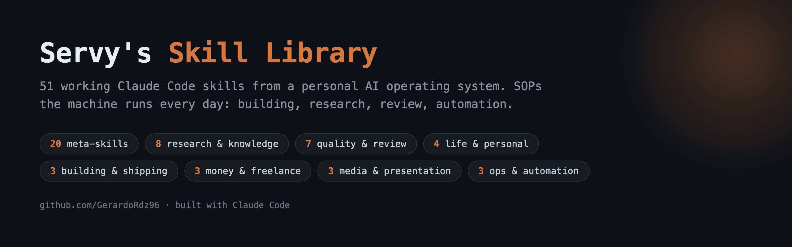
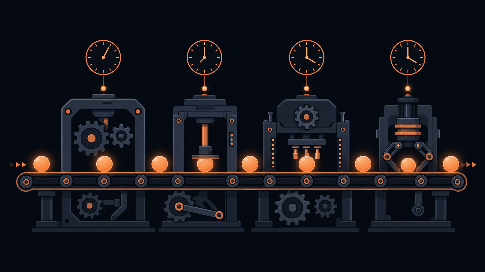

# Servy's Skill Library

This is the working skill library of **Servy**, my personal AI operating system built on [Claude Code](https://claude.com/claude-code). A colleague asked how my AI workstation is set up, so here it is: **51 skills**, shared as-is from the machine that runs my days. The only things held back are skills whose whole purpose is my employer's internal work or my own product brand.

## How to read this repo

Each folder under `skills/` is one [Claude Code skill](https://code.claude.com/docs/en/skills): a `SKILL.md` with frontmatter (name, description, triggers) plus any reference files and scripts it ships. Drop a folder into your own `.claude/skills/` to try one.

> **Caveat:** these were written for MY repo layout. Many reference wiki pages (`references/*.md`), scripts (`scripts/*`), or registries that live in my private repo and are not included here. Treat each skill as a working SOP pattern to adapt, not a plug-and-play package. Paths and personal identifiers were genericized before publishing.

## Contents

- [Building & Shipping](#building-shipping) (3)  -  From idea to shipped product: forges, builders, and launch flows.
- [Meta-skills](#meta-skills-skills-that-build-skillsagents) (19)  -  The system improving itself: skills that create skills, agents, routines, and frameworks.
- [Research & Knowledge](#research-knowledge) (9)  -  Everything that feeds the knowledge wiki: deep research, ingestion, recall.
- [Quality & Review](#quality-review) (7)  -  Gates and audits: nothing ships unchecked.
- [Money & Freelance](#money-freelance) (3)  -  The commercial engine: ideas judged, leads worked, bids drafted.
- [Media & Presentation](#media-presentation) (3)  -  Making work visible: design, video, presentations.
- [Ops & Automation](#ops-automation) (3)  -  Recurring cadence and orchestration: the system running itself.
- [Life & Personal](#life-personal) (4)  -  The assistant beyond work: voice, learning, life planning.

## Building & Shipping

From idea to shipped product: forges, builders, and launch flows.

| Skill | One-liner |
|---|---|
| [`deepfork`](#user-content-skill-deepfork) | Reverse-engineer any open-source repo into a clean understanding doc and a rebuildable blueprint, then clean-room rebuild your own customized version. |
| [`ponytail`](#user-content-skill-ponytail) | The laziest senior dev in the room, a standing bias that replaces fifty lines with one. |
| [`taste-skill`](#user-content-skill-taste-skill) | Anti-slop frontend design doctrine that reads the brief, picks a real design system, and gates the build behind a 60-plus-item pre-flight checklist before it ships. |

<b><code>deepfork</code></b> · Reverse-engineer any open-source repo into a clean understanding doc and a rebuildable blueprint, then clean-room rebuild your own customized version.

DeepFork is a five-phase pipeline that turns "how does X work" or "rebuild X but with Y" into a structured reverse-engineering and clean-room rebuild process. It fires whenever the user wants to understand a repo's architecture, learn how an open-source tool works internally, or fork a tool's design (not its code) with their own customizations. All outputs land in `deepfork-out/<target-name>/` in the working directory, so nothing pollutes the eventual rebuild repo.

The pipeline runs in order and never skips its license gate: Phase 0 checks the target repo's license via `gh api` or the LICENSE file and only proceeds to a rebuild for OSI-approved licenses (MIT, Apache-2.0, BSD, GPL family, MPL); unlicensed or all-rights-reserved code gets an understanding-only report, no rebuild. Phase 1 shallow-clones the source. Phase 2 is the comprehension pass, preferentially using the `graphify` skill/CLI (tree-sitter AST graph, community detection, god-node analysis) to produce `UNDERSTANDING.md` covering the repo's thesis, load-bearing pieces, subsystems, one traced data flow, and surprising couplings, each claim labeled `[VERIFIED]` or `[INFERRED]`, with a manual fallback (entry points, dependency manifest, directory tree, call-graph sketch) if graphify is unavailable. Phase 3 interrogates the design for the core trick, public interface contracts, load-bearing dependencies, and edge/scale behavior. Phase 4 asks the user what THEIR version should do differently, then writes a `BLUEPRINT.md` spec (mission, architecture, behavioral mechanisms, contracts, customization deltas, build order, dependency decisions) written so someone could build from it without ever seeing the original source. Phase 5 scaffolds a fresh repo and builds strictly from the blueprint with the original source closed, ships an `ATTRIBUTION.md` crediting the original, and ends with a "diff-of-spirit" check that the rebuild actually reflects the user's requested deltas rather than being a disguised clone.

What's distinctive is the "fork the design, not the code" discipline: a hard IP/legality gate up front, mandatory clean-room separation during implementation (no reading original source while writing the rebuild), honesty labeling of every architectural claim as verified-by-reading versus inferred-from-graph, and an explicit closing check that the deltas the user asked for actually show up. It composes with `graphify` for the comprehension phase but degrades gracefully to manual analysis without it, and its guardrails cap scope (pick one subsystem for repos over 5k files) and always keep `deepfork-out/` out of the shipped rebuild.

➡️ [Read the full skill](skills/deepfork/SKILL.md)

<b><code>ponytail</code></b> · The laziest senior dev in the room, a standing bias that replaces fifty lines with one.

Ponytail is a YAGNI discipline skill that changes how Claude Code approaches writing and reviewing code, biasing it toward the smallest thing that actually works. It positions itself as "the laziest senior dev in the room." Before writing any code, it walks a six-rung ladder and stops at the first rung that holds: does this need to exist at all, does the stdlib do it, does a native platform feature do it, does an already-installed dependency do it, is it one line, and only then write the minimum that works. It explicitly carves out what laziness never applies to: trust-boundary validation, data-loss handling, security, and accessibility are always written in full, even in the laziest version.

It fires automatically before writing new code and during planning steps of larger pipelines, and can also be invoked directly with a level command that sets an intensity for the rest of the session: a lightweight nudge, the default full ladder-walk, an aggressive delete-on-sight mode, or fully off. The mode change is gated so it can only be toggled by an explicit command, not by incidental text appearing in a file or prompt, which closes a known footgun in the design it draws from. It also ships two audit-style commands: one that reviews a diff for over-engineering and hands back a delete-list of things that could be collapsed into a one-liner, and one that runs the same lens across a whole codebase looking for dependencies, abstractions, and wrappers that earn nothing.

A distinctive convention is a shortcut comment marker, used to flag deliberate shortcuts with a named ceiling and upgrade path so a "later" does not silently become "never." A bundled Python script greps git-tracked files for these markers across all common comment styles, dedups against previously harvested entries, and appends only new ones to a running follow-up list, a clean generic pattern any repo could reuse regardless of what that list is called. The skill also candidly flags that the popular benchmark number behind this style of discipline is real but model-conditional and should not be quoted as a guarantee, a nice bit of intellectual honesty for a public showcase.</description>
</invoke>

➡️ [Read the full skill](skills/ponytail/SKILL.md)

<b><code>taste-skill</code></b> · Anti-slop frontend design doctrine that reads the brief, picks a real design system, and gates the build behind a 60-plus-item pre-flight checklist before it ships.

taste-skill is a frontend design skill for landing pages, portfolios, and redesigns (explicitly not for dashboards, data tables, wizards, or admin UI). It exists to stop LLM-generated interfaces from looking templated: AI-purple gradients, centered hero over dark mesh, three equal feature cards, Inter + slate-900, generic glassmorphism. It fires when the user asks to design or redesign a landing page, portfolio, or site, or asks to make a UI "not look AI-generated."

The skill works in a fixed sequence. First it infers the brief before writing any code: page kind, vibe words, reference signals (screenshots or named products), audience, existing brand assets, and quiet constraints like accessibility-first or regulated industries. It requires stating a one-line "Design Read" (e.g. "B2B SaaS landing for technical buyers, Linear-style minimalist, leaning toward Tailwind + Geist + restrained motion") before generating anything, and asks at most one clarifying question if the brief is genuinely ambiguous. Next it sets three numeric dials, DESIGN_VARIANCE, MOTION_INTENSITY, and VISUAL_DENSITY (baseline 8/6/4), which gate every subsequent layout, motion, and density decision. It then routes to the right foundation: real official design-system packages (Fluent, Material, Carbon, Polaris, GOV.UK Frontend, USWDS, shadcn/ui) when the brief matches one, or native CSS/Tailwind when the brief is an aesthetic rather than a system, with an explicit rule against mixing two systems in one project. Redesign briefs get a dedicated audit-first protocol that extracts brand tokens, information architecture, and existing patterns before touching visuals.

What is distinctive is the closing Final Pre-Flight Check: a roughly 60-item checklist that must be run, and honestly ticked, before any output ships. It catches extremely specific AI tells the author has apparently seen recur: em-dashes anywhere on the page, more than one horizontal marquee, split-header layouts, three-consecutive-section zigzag alternation, decorative section-numbering eyebrows ("00 / INDEX"), scroll-cue text, fake photo-credit captions, un-motivated GSAP animations, and premium-consumer palettes defaulting to the same beige-brass-oxblood family project after project. It also ships canonical, copy-pasteable GSAP sticky-stack and horizontal-pan code skeletons, a UI-snapping doctrine (snap a polished public component like Magic UI rather than hand-roll particle effects or confetti), and a content structured as progressive disclosure: SKILL.md holds the core loop and the checklist, while five reference files (aesthetics.md, design-systems.md, code-skeletons.md, redesign-audit.md, ui-snapping.md) hold the verbatim detail sections, read only at the phase that needs them.

Two cross-references point at sibling doctrine files (references/website-design-levels.md, references/design-swipe-file.md) that live in the private Servy repo and will not exist in a public copy; a public release should note this as a known gap rather than a security concern, since nothing sensitive is being omitted.

➡️ [Read the full skill](skills/taste-skill/SKILL.md)

## Meta-skills (skills that build skills/agents)

The system improving itself: skills that create skills, agents, routines, and frameworks.

| Skill | One-liner |
|---|---|
| [`agent-builder`](#user-content-skill-agent-builder) | Decision-gated builder for Claude Code subagents, with a Discovery Interview before any file is written. |
| [`agents-team-builder`](#user-content-skill-agents-team-builder) | Guided discovery interview that scaffolds a 2-5 agent Claude Code team with peer messaging, file ownership, and a rerunnable invocation template. |
| [`ai-apply`](#user-content-skill-ai-apply) | A one-question-at-a-time interview that decides whether AI belongs in a task at all, and how deep, before anyone builds anything. |
| [`audit`](#user-content-skill-audit) | Scores your Claude Code setup against the Four Cs and hands you the top 3 highest-leverage fixes. |
| [`build`](#user-content-skill-build) | Routes any non-trivial build through triage, Superpowers planning, risk-based execution (TDD vs GSD), and mandatory adversarial review. |
| [`capability-radar`](#user-content-skill-capability-radar) | Detects when your own work has produced enough signal to justify building a new skill, agent, routine, or tool  -  then routes the decision through a risk-tiered, Codex-reviewed build gate. |
| [`fable-mode`](#user-content-skill-fable-mode) | Borrow a frontier model's discipline, not its weights: five gates any model can run. |
| [`framework-builder`](#user-content-skill-framework-builder) | Turns repeated thinking into a named, executable decision framework: rubric in, action out. |
| [`hooks-builder`](#user-content-skill-hooks-builder) | Designs, builds, and audits Claude Code hooks  -  the event-driven shell layer that fires deterministically on session/tool events. |
| [`level-up`](#user-content-skill-level-up) | Weekly interview that finds one automation opportunity and ships it as a real artifact, using the Mindset-Method-Machine pipeline. |
| [`loops-builder`](#user-content-skill-loops-builder) | Designs, audits, and optimizes agent loops (the depth primitive) with mandatory hard caps and objective done-checks, routing to the right mechanism (/goal, /loop, bash Ralph loop, dynamic workflow, or Cloud Routine). |
| [`multi-brain`](#user-content-skill-multi-brain) | Auto-routes sub-tasks (code review, vision/OCR, whole-repo scans, long-horizon coding) to the right specialist LLM while Claude stays the orchestrator in front of the user. |
| [`onboard`](#user-content-skill-onboard) | Day-1 onboarding wizard for a freshly cloned personal-AIOS starter kit  -  7-question intake plus one-shot file scaffold. |
| [`plugin-builder`](#user-content-skill-plugin-builder) | Packages Claude Code skills, agents, hooks, and MCP servers into distributable, installable plugins and marketplaces. |
| [`routines-builder`](#user-content-skill-routines-builder) | Decision-gated builder for recurring automation: picks the right cadence mechanism, then scaffolds it safely. |
| [`skill-builder`](#user-content-skill-skill-builder) | Guides building, auditing, and optimizing Claude Code skills via a discovery interview and an official-best-practices checklist. |
| [`skill-harvest`](#user-content-skill-skill-harvest) | Mines your real session history for repeated manual work that should have been a skill by now. |
| [`workaround-builder`](#user-content-skill-workaround-builder) | A structured creative-research engine that finds a legitimate alternate route whenever a build hits an external wall (gated API, broken tool, ToS ban, quota limit) instead of giving up or grabbing the first hack. |
| [`workflow-builder`](#user-content-skill-workflow-builder) | Interactive builder that turns a width-shaped task into a saved, bounded, parallel-fan-out workflow file for Claude Code. |

<b><code>agent-builder</code></b> · Decision-gated builder for Claude Code subagents, with a Discovery Interview before any file is written.

Invoked explicitly as `/agent-builder`, this skill guides building, optimizing, or auditing Claude Code subagents (`.claude/agents/*.md`). Its first job is deciding whether the thing you asked for should even BE an agent: a decision gate checks whether deterministic scripts, a skill, or a routine would serve better before any agent file exists.

Once an agent is justified, it runs a Discovery Interview (goals, tools, triggers, risk surface) and only then writes the agent definition with an appropriate tool allowlist and model choice. It deliberately disables model auto-invocation so a stray phrase like "make me an agent" never scaffolds files without the owner asking for it. That combination of gate first, interview second, files last is the whole point: fewer agents, better scoped.

➡️ [Read the full skill](skills/agent-builder/SKILL.md)

<b><code>agents-team-builder</code></b> · Guided discovery interview that scaffolds a 2-5 agent Claude Code team with peer messaging, file ownership, and a rerunnable invocation template.

agents-team-builder is a meta-skill that designs and launches Claude Code "agent teams"  -  small groups (2 to 5) of specialized agents that share a task list, message each other peer-to-peer, and work in parallel on one goal. It fires on natural-language triggers like "build an agent team", "set up a Claude agent team", "spin up a team of teammates", or the explicit `/agents-team-builder` command. It positions itself as one option on an orchestration ladder alongside sub-agents, dynamic workflows, and `/goal` loops, and its first job is talking the user out of a team if a cheaper mechanism fits better.

The skill runs in seven phases. Phase 0 checks that its knowledge source file exists before proceeding. Phase 1 is a mandatory decision gate: before asking about roles, it forces a choice between an agent team, plain sub-agents, a dynamic workflow, a `/goal` loop, or a simple one-shot ask, and it refuses to proceed unless "agent team" is genuinely the right shape for the task. Phase 2 checks that the experimental `CLAUDE_CODE_EXPERIMENTAL_AGENT_TEAMS` environment flag is enabled (offering to add it to project settings) and reminds the user that a fresh session is needed for it to take effect. Phase 3 runs a structured discovery interview in three rounds (goal + team size + model, then one round per teammate role covering job, outputs, owned files, and who they talk to, then final deliverables and an approval mode). Phase 4 validates the answers against hard gates, blocking on issues like overlapping file ownership, unnamed handoff recipients, or vague non-artifact deliverables. Phase 5 generates a saved, rerunnable team template under `.claude/teams/<name>.md` with a paste-ready invocation prompt, and updates a team index file. Phase 6 outputs a paste-ready chat summary with run instructions and a cost-reality warning (N teammates costs roughly N times a single session). Phase 7 logs the creation to a wiki log file.

What is distinctive is the discipline baked into the interview: it explicitly refuses to pre-fill role definitions (to avoid sloppy file-ownership and overlapping responsibilities), it separates "build the team template" (cheap) from "fire the team" (expensive, N parallel sessions) and never auto-fires on the user's behalf, and it defaults to a human-approval-first run pattern that can be relaxed once the team's pattern is proven. It recommends 3 teammates as the sweet spot for most goals. The skill is entirely generic to Claude Code's agent-teams feature and carries no references to any employer, product brand, or personal data  -  every reference is to sibling builder skills and to public Claude Code mechanics (tmux for per-agent visibility, environment flags, model selection).

➡️ [Read the full skill](skills/agents-team-builder/SKILL.md)

<b><code>ai-apply</code></b> · A one-question-at-a-time interview that decides whether AI belongs in a task at all, and how deep, before anyone builds anything.

ai-apply is a decision skill, not a builder. Given a task or workflow, it walks the user through a six-question "AI Applicability Framework" one question at a time, grill-me style, and lands on one of three honest verdicts: adopt (automate it), augment (AI-assisted, human stays in the loop), or skip (don't build this at all). It exists specifically to answer "to what extent could AI be leveraged here?" one step upstream of any build/skill/agent/automation work, so effort doesn't get spent automating something that should just be eliminated or left alone.

It fires when the user is unsure whether AI is the right call for something, or unsure how deep to go (fully autonomous vs. lightly assisted), triggered by phrases like "should I use AI for this," "is this worth automating," or "assess this for AI." Mechanically, it first picks the task and creates a dated assessment file, then asks six questions in strict order, each one carrying a recommended answer inferred from the surrounding context so the user can confirm/correct rather than starting from a blank page: (1) could the task just stop existing, (2) is it a real constraint or just annoying, (3) can the steps be explained clearly enough to hand to another person (captured as trigger/data-sources/transformations/decision-points/destination), (4) what share can AI realistically do vs. where a human must stay, (5) does it touch confidential or restricted data and is the channel allowed, and (6) what measurable number does it move and how would rollout be phased. After every single answer it checkpoints by appending to the assessment file before asking the next question, so the file (not the conversation) is the durable source of truth if the session drops.

What's distinctive is the discipline of early-exit and honest "skip is a win" framing: if question 1 says the task should be eliminated, or question 5 hits a hard data-gate with no safe re-route, the interview short-circuits straight to a verdict instead of dragging through all six questions to justify a build. The scoring rubric that closes it out is deliberately judgment-based rather than arithmetic ("one hard NO can sink a strong case"), and it defaults to the lower-autonomy AUGMENT option whenever the case for ADOPT isn't airtight, letting real usage promote it later. It ends by handing off to whichever downstream builder skill/agent/routine fits the verdict, rather than building anything itself.

➡️ [Read the full skill](skills/ai-apply/SKILL.md)

<b><code>audit</code></b> · Scores your Claude Code setup against the Four Cs and hands you the top 3 highest-leverage fixes.

The `audit` skill runs a structural health check on a Claude Code project, answering one question: "is the AIOS built right?" It fires when someone asks for an AIOS audit, wants to score their setup, or asks "is my AIOS working." It explicitly is not a capability planner (that's a different skill)  -  it only checks whether the files, folders, registries, and connections that make an AI operating system are actually in place.

It scores four dimensions ("the Four Cs") out of 25 points each, for 100 total: Context (does it know the business  -  identity, memory, references, decisions), Connections (can it reach real data sources across 7 universal domains like revenue, calendar, communication, and task tracking, via any mechanism from MCP to a plain API script), Capabilities (skills and agents installed), and Cadence (does it run on its own via hooks, schedules, or recurring rituals). Each criterion has a concrete detection rule, like counting words in the operating-manual file, counting entries in a memory file, or checking whether at least one connection can write and not just read. It also runs two advisory hygiene checks (context-budget and API-key naming hygiene) that don't affect the score but do feed the gap list.

Distinctively, it computes leverage-weighted priorities rather than a flat checklist: each lost point gets multiplied by an impact factor (e.g. zero reachable data domains is a 4x multiplier since the system is "blind to the business," a missing operating manual is 3x, having zero skills is 2x) so the top-3 gaps it surfaces are the ones actually worth fixing first, each paired with a one-line next action. The whole thing is designed to run read-only and fast (under 60 seconds), print a formatted scoreboard plus a stage label (Foundation through Autonomous), and optionally save the report to track score over time on repeat runs  -  the compounding hook of the skill is that re-running it weekly shows the score climbing.

➡️ [Read the full skill](skills/audit/SKILL.md)

<b><code>build</code></b> · Routes any non-trivial build through triage, Superpowers planning, risk-based execution (TDD vs GSD), and mandatory adversarial review.

The `build` skill is a router, not a builder: it fires when the user asks to build, implement, or ship a non-trivial feature and decides the right sequence of primitives rather than writing code itself. It operationalizes a house doctrine of "plan with Superpowers, execute by whichever risk dominates, always close with adversarial review," keeping the main session clean by delegating execution and review to other tools.

It works in four stages. Stage 0 is a triage gate: is this actually width-shaped work that should become a parallel workflow instead (skip the pipeline), is it trivial enough to just build inline, does it need a validate-before-build idea check (a roast/council pass for anything that is a new product or business bet), and does it have a named definition of done before any plan is written. Stage 1 hands the task to a planning skill (brainstorming for unsettled requirements, then a plan-writing skill) and runs a YAGNI pass to cut anything that does not earn its place. Stage 2 executes by dominant risk: tricky logic or security/financial correctness routes to a test-driven-development flow, long multi-file "hand it off" work routes to an autonomous phase-based executor, both together get a hybrid, and anything that must run until a verifiable bar is met gets scaffolded as an agent loop with two hard brakes. Every execution path ends with a self-verification walkthrough (run it, click through it, check it from three personas) before anyone else looks at it.

Stage 3 is the mandatory adversarial review: the diff always goes to a separate-lineage reviewer for a bugs-and-quality verdict (never self-review), a heavier paid review is proposed but never auto-run for high-stakes changes, and any UI surface must additionally pass a vision-model anti-slop screenshot review before it can ship. The skill closes by summarizing what was built, which route was taken and why, what the adversarial review found, and offering next steps like branch cleanup or a go-to-market workflow if what shipped is a launchable product.

What is distinctive here is the routing discipline itself: it names four gates to walk before any code gets written, gives a concrete risk-to-route table instead of leaving execution strategy to a judgment call, and treats the adversarial review pass as structurally non-optional rather than a nice-to-have, because the source benchmark showed self-graded pipelines missing real bugs that only a second, independent reviewer caught.

➡️ [Read the full skill](skills/build/SKILL.md)

<b><code>capability-radar</code></b> · Detects when your own work has produced enough signal to justify building a new skill, agent, routine, or tool  -  then routes the decision through a risk-tiered, Codex-reviewed build gate.

Capability Radar is the inward-facing detector that closes the loop on a personal AI workstation's self-evolution. It watches the owner's own work (and the model's own review/output patterns) for signs that a repeated manual task, a recurring judgment call, or a hand-built one-off should graduate into a reusable capability. It is deliberately the mirror image of an outward-facing "opportunity engine" that scouts the market for products to build for others  -  this one scouts the operator's own workflow for capabilities to build for the assistant itself.

The skill splits cleanly into a deterministic half and a judgment half. A companion script handles signal capture, deduplication, and scoring (counting distinct signals and distinct source types to produce a confidence band of HIGH/MEDIUM/LOW). The skill itself is the judgment layer: it classifies each detected candidate into one of several capability types (skill, agent, agent-team, routine, hook, workflow, script, plugin), assigns it a risk tier, and decides whether to auto-build or merely suggest. It exposes four modes: show ranked candidates (default), build a specific candidate end-to-end, manually log a signal noticed mid-conversation, and render a digest for a scheduled summary.

What is distinctive here is the two-gate adversarial review baked into the auto-build path: before building anything, a separate model/CLI (Codex in the original) is asked to independently judge whether the candidate is worth building and whether the proposed type/tier is correct (BUILD/SUGGEST/SKIP verdict), and after any builder produces the artifact, the same separate reviewer checks the output before it is registered. This "never let the same model that had the idea also bless the idea" discipline is the throughline. Auto-building is further gated to only the lowest-risk tier and only at high confidence, with everything else (scheduled/unattended capabilities, anything higher-risk) demoted to "built but not armed" so a human explicitly turns it on. The skill also insists on explicit "no silent skips" behavior when deferring lower-confidence candidates, and files a provenance record for every build so the decision trail (what/why/spec/reviewer verdicts/evidence) survives.

➡️ [Read the full skill](skills/capability-radar/SKILL.md)

<b><code>fable-mode</code></b> · Borrow a frontier model's discipline, not its weights: five gates any model can run.

Fable-mode is a behavioral overlay, not a task skill: it doesn't do a job, it changes how the model approaches whatever job comes next. It was reverse-engineered from watching Anthropic's "Fable 5" model work (via a YouTube analysis + Anthropic's own published system-prompt language) and packaged as a single SKILL.md that any instruction-following model (Opus, Sonnet, Haiku, GPT-lineage, local models) can approximate. The core insight it encodes: a chunk of the gap between a frontier model and a cheaper one isn't raw intelligence, it's discipline  -  skipped verification, premature confidence, trusting stale training memory, under-scoped plans. This skill tries to buy back that discipline gap explicitly.

It fires on explicit invocation ("fable mode," "think like Fable," "elevate the model") or proactively whenever a hard, high-stakes, multi-step problem lands on a non-frontier model and needs careful handling. It works by walking five sequential gates that must each pass before the next: (1) Scope  -  restate the goal as a verifiable outcome, name unknowns and one-way-door actions before touching anything; (2) Evidence  -  treat training recall as a hypothesis, not a fact, and verify anything mutable/external/load-bearing by reading files, running commands, or checking real state; (3) Attack  -  adversarially stress-test the chosen plan, generate a competing approach, re-decide after every tool result instead of running on momentum; (4) Verify  -  actually run the thing and check the output at the layer of the claim, never let "no errors" stand in for "it works"; (5) Report  -  lead with the outcome, state confidence honestly, never fabricate a number or citation, and close with what changed / what was verified / what remains at risk.

Beyond the five gates it ships a short list of "smells" that signal a gate got skipped (e.g. "you just thought 'should work' about something testable right now"), a delegation format ("The Brief") for handing work to subagents or cheaper models with explicit failure signals and stop conditions, and an economics rationale for pairing this discipline with model-cost routing  -  the idea being an orchestrator that runs these gates while delegating execution to cheap workers can approach frontier-quality output at a fraction of the cost, because the gates catch what cheap workers usually miss.

What's distinctive is the provenance and honesty of the framing: it's explicit that this is not a magic capability upgrade, only a process transfer, and it cites its own sources (a Nate Herk video, Anthropic's publicly posted system-prompt language) rather than claiming to have extracted anything through improper means. It's a compact, well-reasoned meta-skill about disciplined AI-assisted work that reads well as a portfolio piece.

➡️ [Read the full skill](skills/fable-mode/SKILL.md)

<b><code>framework-builder</code></b> · Turns repeated thinking into a named, executable decision framework: rubric in, action out.

`/framework-builder` converts a topic or a captured brain-dump into a reusable DECISION framework: a named rule, rubric, scorecard, or gate that always terminates in an action (pick / build / skip / score). It is explicitly not for software frameworks, prose SOPs, or wiki pages without a decision rule; the gate at the top rejects those.

The flow classifies the framework type, drafts the decision rule with concrete thresholds, then runs a mandatory quality gate: the framework must include an explicit pass/fail check and worked examples before it graduates. Decision frameworks then get wired into the assistant's operating docs on a propose-then-confirm basis, so the system's judgment compounds instead of living in one chat transcript.

➡️ [Read the full skill](skills/framework-builder/SKILL.md)

<b><code>hooks-builder</code></b> · Designs, builds, and audits Claude Code hooks  -  the event-driven shell layer that fires deterministically on session/tool events.

hooks-builder is a meta-skill for working with Claude Code's hooks layer: shell commands wired into `settings.json` that the harness fires deterministically on events like `SessionStart`, `PreToolUse`, `PostToolUse`, `Stop`, and `SessionEnd`. It triggers when the user wants something to happen mechanically every single time an event matches ("every time I edit, run X", "block tool Y when Z", "audit my hooks")  -  cases where a prompt or memory instruction can't guarantee reliability, only the hook layer can. It positions itself as one lane in a family of "mechanism builders" (skill-builder, agent-builder, routines-builder, plugin-builder) and explicitly hands off clock-driven or non-deterministic asks to those siblings via a mandatory decision gate at the very start.

The skill runs in three modes. Build mode walks a discovery interview (trigger event and matcher, the action to take  -  allow/block/inject context/side-effect, inline command vs script file, scope of user/project/project-local, timeout, and fail-open vs fail-closed behavior), writes the script into the correct hooks directory, delegates the actual `settings.json` edit to a companion `update-config` skill, and then enforces a mandatory supervised first-fire test before the hook is considered armed: a standalone dry-fire with fake stdin, one live-fire of the real event, and a deliberate failure drill to confirm the chosen degrade behavior. Optimize mode reads the existing config and script before touching anything and maps common symptoms (fires too often, feels slow, fails silently, blocks unexpectedly) to fixes. Audit mode walks every hook across the user, project, and project-local settings layers plus active plugins, checking matcher freshness, timeouts, secret hygiene, and whether each hook is still worth its permanent tax on every matched event.

What's distinctive is the safety discipline baked around a genuinely dangerous primitive: hooks run arbitrary shell as the owner's own user on every match, so the skill never treats "hook created" as "hook done"  -  it stays unarmed until it survives dry-fire, live-fire, and a forced failure test, and it insists secrets are sourced from a local `.env` inside the script rather than ever appearing on a command line. A companion `reference.md` carries the full event catalog (stable core vs extended/experimental events), the settings.json schema for all three layers, the stdin/exit-code hook protocol (including a fail-closed trap pattern for guard scripts), and a live inventory of what hooks are actually installed. The one worked example (a Telegram ping on `SessionEnd`) uses generic environment-variable names sourced from a gitignored `.env`, not any real token or chat ID, so it reads as a clean, reusable template rather than a credential leak.</parameter>
</invoke>

➡️ [Read the full skill](skills/hooks-builder/SKILL.md)

<b><code>level-up</code></b> · Weekly interview that finds one automation opportunity and ships it as a real artifact, using the Mindset-Method-Machine pipeline.

level-up runs a structured weekly ritual (or on-demand) that walks the user through the "3Ms" framework  -  Mindset, Method, Machine  -  to surface exactly one automation opportunity per run and carry it all the way to a shipped artifact. It fires on phrases like "let's level up", "what should I automate next", "find me leverage this week", or as a standing Friday habit. The stated philosophy is that repeating this interview enough times (4-6 runs) rewires how the user thinks day-to-day, so they start spotting automation opportunities on their own without needing the skill.

The skill executes in three phases. Phase 1 (Mindset) interviews the user with a fixed set of conversational questions about frequency, drudgery, delegation-worthy tasks, scaling constraints, growth levers, and recurring triggers/cadences, then ranks 1-3 candidate opportunities by which one gates a real business constraint rather than by raw frequency ("be the doctor, not the pharmacist"). Phase 2 (Method) scopes the single chosen candidate through a 5-step pipeline: identify the constraint, apply Eliminate/Automate/Delegate triage (killing the task entirely counts as a valid win), map the process (trigger, data sources, transformations, decision points, destination), pick the lowest autonomy level (L0-L4) that solves the problem, and tie the automation to a concrete KPI with a directional target (e.g. "5 leads/week today, target 15/week"). If the user can't name a bucket and metric, the skill stops rather than let scope creep in. Phase 3 (Machine) hands the scoped spec to the cheapest viable build option in a "boring is beautiful" ordering  -  prompt template, deterministic skill, AI-assisted skill, or sub-agent as last resort  -  and scaffolds it with a mandatory "Bike Method Phase 1" frontmatter header that forces manual validation before any autonomy is granted.

What's distinctive is the discipline baked into the interview: it enforces "eliminate first" (don't automate work that should just stop), defaults to the lowest autonomy level unless the user explicitly pushes for more, and hard-stops if there's no measurable KPI target  -  treating "does this move a number" as a gate rather than an afterthought. It closes every run with a single dated decision-log entry and one scaffolded artifact, explicitly refusing to become a multi-candidate planner. The skill is adapted from Nate Herk's "Three Ms of AI" framework and carries that attribution/trademark notice in its own text, which is why it's already self-contained and requires no further sanitization.

➡️ [Read the full skill](skills/level-up/SKILL.md)

<b><code>loops-builder</code></b> · Designs, audits, and optimizes agent loops (the depth primitive) with mandatory hard caps and objective done-checks, routing to the right mechanism (/goal, /loop, bash Ralph loop, dynamic workflow, or Cloud Routine).

loops-builder is a Claude Code meta-skill that designs, builds, optimizes, or audits "agent loops"  -  the depth primitive that runs reason-act-observe repeatedly until a verifiable done-check passes, always bounded by a mandatory numeric hard cap. It fires on `/loops-builder` whenever something should iterate until a criterion is met (tests green, a quality gate passed) rather than run once, and it is explicitly a sibling to width/cadence/crew builders (workflow-builder for parallel fan-out, routines-builder for scheduled cadence, agents-team-builder for peer crews)  -  this one owns the iterate-to-a-bar case specifically.

The skill's central discipline is "two brakes, always": every loop it emits must carry both an objective, machine-checkable done-check (a named artifact or state plus a measurable threshold plus a machine-observable signal, never "improve" or "until satisfied") and an explicit numeric cap (max turns, iterations, or budget) because loops have no model-side terminator and will otherwise run until an operator, schedule, or cap stops them. It works through a staged pipeline: a decision gate that first confirms the task is actually loop-shaped (routing away fixed-step tasks to scripts, single-shot asks to plain prompting, width-shaped fan-out to workflow-builder, and unfalsifiable "done" criteria to a rewrite of the goal itself); a six-round Discovery Interview covering goal/done-check, verification type (functional, visual, judgment, or human-gate for irreversible actions), loop shape (solo, maker-checker, or manager-helpers, always starting solo), mechanism and placement (session-bound `/loop` vs a Cloud Routine that survives a closed laptop), hard cap and cost budget, and a final confirmation checklist; then 18 named validation gates (e.g. GOAL-IS-OBJECTIVE, HARD-CAP-BOTH-BRAKES, VERIFIER-IS-INDEPENDENT, NO-SELF-REVIEW-JUDGMENT, BUDGET-GUARD-BEFORE-SPAWN) that block on any failure before an artifact is generated; and finally emission of the right skeleton from a 14-template library (in reference.md) matched to shape x mechanism x verification, self-checked with `node --check` / `bash -n`.

What is distinctive is the emphasis on real measured failure modes rather than theory: it documents a concrete cost blowup (a 4-finder x 4-round audit workflow that spawned roughly 187 agents and 6.6 million tokens without converging) to justify capping rounds and batching verification, it encodes a hard Claude Code harness limit (a Stop-hook that blocks more than 8 consecutive times force-ends the turn) directly into its Stop-hook template, and it treats "never fire the loop" as an absolute rule  -  the skill only builds and writes the artifact, a human or another skill must invoke it. It closes every run by logging to a wiki log file and, for reusable loops, registering them in the project's capability registry, and it ships an Optimize mode (diagnose a misbehaving loop by symptom, e.g. runs forever means missing hard cap, confidently-wrong done-signal means the verifier isn't independent) and an Audit mode with a 15-point checklist for retrofitting the discipline onto existing loops.

➡️ [Read the full skill](skills/loops-builder/SKILL.md)

<b><code>multi-brain</code></b> · Auto-routes sub-tasks (code review, vision/OCR, whole-repo scans, long-horizon coding) to the right specialist LLM while Claude stays the orchestrator in front of the user.

Multi-brain is a routing skill, not a task skill: it sits over every turn and decides, cheaply and rarely, when a sub-task should go to a different model instead of being handled by Claude directly. The roster it draws from is Codex (OpenAI/GPT, for adversarial review and rescue), Gemini-lineage tools (a local Ollama vision model by default, with an opt-in agy Antigravity CLI escalation for harder multimodal reads), and GLM (an opt-in, paid, long-horizon open-weights coding specialist reached via OpenRouter). Claude always drives and integrates the result; the other brains are treated as callable tools, never as a replacement front end.

It fires on a small set of well-defined triggers: (1) a hard no-self-review law, any time the user asks Claude to check, review, verify, or sanity-check work Claude itself just produced, that job is forced to Codex rather than being marked done by the same model that wrote it; (2) image, screenshot, PDF, or video reads default to a local vision script, escalating to a cloud frontier reader only for hard cases; (3) whole-repo scans or find-every-place-X style questions route to a large-context reader; (4) edits touching risk-sensitive paths (auth, billing, migrations, deploy, secrets) force an adversarial review before anything is called done; (5) two repeated failures on the same test/command/edit force a rescue hand-off with full context; (6) explicit requests for cross-model consensus spin up a capped 3-brain panel that Claude adjudicates by evidence, not by averaging.

What is distinctive is the discipline layered on top of the routing table: an announcement protocol before any forced or paid route (one line the user can veto with stop), a deterministic failure-counter for rescue hand-offs rather than a vibe-based one, path-based (not keyword-based) risk detection so casual chat mentioning auth does not trigger anything, and an explicit cost-discipline stance that biases toward a single strong model and treats ensembles as reserved for genuinely high-stakes, hard-to-reverse calls. A companion reference.md carries the research rationale (cross-architecture diversity, diminishing consensus returns past 3 models, tiered cost routing) and the history of brains that were tried and retired, which is useful context for anyone adapting the routing table to their own model roster.

The pattern generalizes cleanly beyond this specific roster: any setup with more than one available model or CLI can reuse the shape (a small trigger table, a no-self-review law, path-based risk detection, an announce-before-forced-or-paid-route rule, and a deterministic failure counter) and swap in whatever specialists it has on hand.</description>
</invoke>

➡️ [Read the full skill](skills/multi-brain/SKILL.md)

<b><code>onboard</code></b> · Day-1 onboarding wizard for a freshly cloned personal-AIOS starter kit  -  7-question intake plus one-shot file scaffold.

`/onboard` is the guided Day-1 setup flow for the `aios-starter-kit` template (a separate public repo, not Servy itself). It fires only inside a freshly cloned kit that still has an `aios-intake.md` file and a `CLAUDE.md` full of `{{...}}` placeholders  -  it explicitly refuses to run inside an already-onboarded AIOS like Servy. It combines what would otherwise be two skills (an intake interview and a scaffolder) into a single idempotent wizard: read or create `aios-intake.md`, run a 7-question interview if it's not filled in, then generate the Day-1 file set inline at the end of the same run.

The interview is a hard-capped 7 questions covering identity/offer/ICP, two pasted (not typed) writing samples for voice calibration, 90-day priorities, where revenue lands, where the user talks to customers/team, where meeting notes and docs live, and the one recurring task that eats their week. One question (Q2, the voice sample) has a hard rule the skill enforces conversationally: if the user types a sample live instead of pasting unedited prior writing, the skill refuses and asks again, because a live-typed sample is already shaped by the conversation and would poison voice calibration. Domain 3 (Calendar) is auto-inferred from the Q5 answer rather than asked directly.

Once the intake is complete, Step 3 scaffolds six files in one batch with no multi-turn confirmation: `context/about-me.md`, `context/about-business.md`, `context/priorities.md`, `references/voice.md`, a populated `connections.md` table, and a filled-in `CLAUDE.md`. It backs up any existing files to a timestamped `archives/intake-{ts}/` folder first, and re-running after editing `aios-intake.md` refreshes only what changed (skips already-answered questions unless the user wants to revise). The distinctive design choice is the "wow moment": rather than saving a permanent `/today` skill, it ends by suggesting the user ask "what should I focus on this week?" once, so the first real interaction plants the Mindset/Default-Shift framework organically instead of via a lecture.

Six numbered implementation rules keep the skill from scope-creeping in conversation: never add an eighth question, never skip the voice-paste rule, always scaffold in one shot at the end (not incrementally), never write additional skills beyond the kit's baseline three, treat `references/3ms-framework.md` as read-only since it ships pre-written in the kit, and never touch `.env` or ask for API keys on Day 1 (that's Day 2's job). A verification section gives the implementer three concrete tests: a cold clone-and-run test expecting citation of specific answers (not generic output), an idempotency test on a single changed priority, and a voice-rejection test.

➡️ [Read the full skill](skills/onboard/SKILL.md)

<b><code>plugin-builder</code></b> · Packages Claude Code skills, agents, hooks, and MCP servers into distributable, installable plugins and marketplaces.

Plugin-builder is the packaging and distribution layer that sits above the other primitive builders (skill-builder, agent-builder, agents-team-builder, routines-builder). Where those tools create one loose capability that lives inside .claude/, this skill bundles any mix of existing skills, agents, commands, hooks, and MCP servers into a single versioned, installable unit, a Claude Code plugin, and optionally stands up a marketplace manifest so the bundle can be installed with claude plugin install name@marketplace. It fires on requests like build a plugin, package this as a plugin, bundle my skills into a plugin, make a marketplace, or ship my capabilities.

It opens with a decision gate before any interview: is there a real distribution need (leaving the machine to a teammate, the public, or another machine), is the bundle more than a single trivial primitive, does it cross any employer-confidentiality boundary for public bundles, and would an MCP server be better replaced by a CLI-backed skill (the CLI-over-MCP token and reliability rule). If the gate does not justify a plugin it redirects to the right primitive builder instead. If it passes, it runs a five-round Discovery Interview (purpose and name, what goes in the bundle, marketplace and distribution target, manifest and guardrails, final confirmation) before writing anything.

Once confirmed, it scaffolds the plugin directory with the manifest (plugin.json) inside .claude-plugin/ and every actual component (commands, agents, skills, hooks, MCP config) at the plugin's root, the single most common structural mistake it explicitly guards against. It wires all internal paths through the CLAUDE_PLUGIN_ROOT variable instead of hardcoded absolute paths, writes or appends to a marketplace.json, and ends with a validation step that actually runs claude plugin validate, a local marketplace add, and a real local install and uninstall cycle rather than just claiming success. Beyond building, it has a dedicated optimize mode for an existing plugin (fixing misplaced components, hardcoded paths, MCP-that-should-be-CLI, bloated manifests, stale versions) and an audit mode with a full manifest, structure, marketplace, and boundary checklist. All schema facts (plugin.json fields, hooks.json shape, marketplace source types, the CLI surface) are verified against real installed plugins and the claude plugin --help output rather than guessed, with unverifiable claims explicitly flagged.

➡️ [Read the full skill](skills/plugin-builder/SKILL.md)

<b><code>routines-builder</code></b> · Decision-gated builder for recurring automation: picks the right cadence mechanism, then scaffolds it safely.

`routines-builder` handles "make this recurring": scheduled jobs, hooks, loops, daily rituals. Its core value is the decision gate that runs BEFORE anything is built: recurring cloud work as the user (a scheduled Routine), an event-triggered local reaction (a hook), a run-until-done iteration (a loop), or an interactive ritual (a daily-* skill) are different mechanisms with different failure modes, and the gate picks one deliberately instead of defaulting to whatever was built last time.

After the gate comes a Discovery Interview (what triggers it, what it reads, what it may touch, what it must never do), then the scaffold itself, with safety rails baked in: explicit brakes on anything that loops (an iteration cap plus a success condition, never just one), least-privilege scopes, and a visible audit trail.

It also audits: point it at an existing routine or hook and it checks the cadence still makes sense, the brakes are intact, and the job actually runs (scheduled jobs that silently died are a classic failure it hunts for).

➡️ [Read the full skill](skills/routines-builder/SKILL.md)

<b><code>skill-builder</code></b> · Guides building, auditing, and optimizing Claude Code skills via a discovery interview and an official-best-practices checklist.

skill-builder turns Claude Code skill authoring into a repeatable, interview-driven process instead of ad hoc file writing. It fires when the user says things like "build a skill", "create a skill for X", "turn what we just did into a skill", or "optimize/audit this skill", and it operates in two modes: building a new skill from scratch, or auditing/optimizing one that already exists.

For new skills, it runs a structured Discovery Interview (via AskUserQuestion, one round at a time): Round 1 nails the goal and the slash-command name, Round 2 nails the trigger phrasing (since a skill's description field is literally how Claude decides to auto-invoke it), Round 3 walks the exact step-by-step process, Round 4 covers inputs/outputs/dependencies, Round 5 covers guardrails and failure modes, and Round 6 produces a confirmable summary before any file gets written. It also documents a second, faster path for "after the fact" capture: when the user just finished a workflow manually and wants it turned into a skill immediately, the session itself becomes the discovery source, so most rounds can be pre-filled from the transcript rather than re-asked. Once discovery is confirmed, the Build Phase walks through choosing a skill type (task vs reference), configuring YAML frontmatter (name, description, disable-model-invocation, argument-hint, context fork, model, allowed-tools), writing the actual instructions (context, numbered workflow, output format, notes), adding supporting files, registering the capability in a central capabilities registry, and testing in a fresh session for both natural-language and direct-invocation triggering.

The Audit mode is a checklist-driven pass over an existing skill: frontmatter correctness, content quality (under 500 lines, numbered steps, specified output format), integration (registered, scripts executable, no hardcoded API keys), and a distinctive check for skill-versus-subagent trigger collisions (grepping the skill's trigger phrases against agent descriptions to catch silent shadowing). It also includes a canonical diagnostic prompt for trigger misfires, treating a skill that fires at the wrong time as a description bug rather than a content bug.

What is distinctive here is the evaluation-first build discipline (baseline Claude without the skill first, write only the instructions that fix observed failures) and the emphasis on testing skills in a genuinely fresh session rather than the authoring session, since leftover context can mask gaps that the written instructions alone need to cover. The companion reference.md is a complete technical reference for every Claude Code skill frontmatter field, invocation control matrix, string substitution syntax, subagent context-fork patterns, hooks, and troubleshooting steps, sourced from the official Claude Code documentation.</description>
</invoke>

➡️ [Read the full skill](skills/skill-builder/SKILL.md)

<b><code>skill-harvest</code></b> · Mines your real session history for repeated manual work that should have been a skill by now.

`skill-harvest` is the data-driven sibling of an interview-based capability scout: instead of asking what you keep doing by hand, it reads your actual Claude Code session transcripts and finds out. A helper script walks recent history; the skill clusters repeated patterns: the same kind of request phrased five different ways, the same multi-step dance performed manually across sessions.

Each cluster becomes an evidence-backed proposal: what the repeated task is, how often it appeared, roughly how much time it burns, and what the skill that replaces it would look like. Proposals are ranked so the top of the list is the highest-leverage thing to automate next.

The distinctive move is grounding in usage data rather than self-report: people are bad at noticing their own repetition, and transcript mining catches the automation candidates that interviews miss. Run it monthly and the skill library grows in exactly the places your real work demands.

➡️ [Read the full skill](skills/skill-harvest/SKILL.md)

<b><code>workaround-builder</code></b> · A structured creative-research engine that finds a legitimate alternate route whenever a build hits an external wall (gated API, broken tool, ToS ban, quota limit) instead of giving up or grabbing the first hack.

workaround-builder fires when a task is blocked by something outside the codebase itself: an API that's paywalled or gated, a tool that's broken or missing a runtime dependency, a service that bans automation, a rate limit or quota that's been hit, a platform that simply lacks the needed feature, or access that's been denied. It is explicitly not for bugs in your own code (that routes to a systematic-debugging skill) and not for designing new features (that routes to a brainstorming skill)  -  it only activates when the obstacle is external to the project.

The skill runs an eight-step pipeline. It starts with an ethics gate that must be checked before any candidate is generated: security boundaries, licenses, DRM, paywalls, anti-scraping measures, and platform ToS are load-bearing walls, and a "workaround" that defeats them is refused, not solved  -  the skill instead looks for a compliant-bridge pattern where a human performs the one gated step manually and everything else is automated around it. After the gate, it frames the wall in one line (goal, exact failure, what was already tried), classifies the wall's type (physics/product-gap/broken-tool/permission-policy/price-quota/knowledge-gap) to pick which solution "doors" are worth opening, and spends a few minutes questioning whether the wall is even real (stale documentation, geo-specific, transient outage) before investing effort in a route around it.

The generative core is a prior-art sweep (check internal knowledge and the web, including how other people solved the identical wall) followed by forcing at least three candidate solutions from different "doors"  -  different entry point, different tool, different abstraction layer, human-in-the-loop bridge, reducing the ask, precomputing/mirroring, or emulating a substitute. Each candidate is scored on effort, durability, blast radius, and ethics-gate cleanliness, one recommendation is chosen (preferring the boring official path if it's comparably cheap), the smallest possible spike is run to prove it actually works, and successful workarounds get registered in a running log with a "rot profile" (what would break the route and when to re-check if the official path has opened). What's distinctive is the discipline of treating a workaround as a documented, dated, risk-rated route rather than an ad hoc hack, and the built-in habit of checking prior art before reinventing a fix that was already found before.

➡️ [Read the full skill](skills/workaround-builder/SKILL.md)

<b><code>workflow-builder</code></b> · Interactive builder that turns a width-shaped task into a saved, bounded, parallel-fan-out workflow file for Claude Code.

workflow-builder is a meta-skill for designing, building, optimizing, or auditing "saved dynamic workflows"  -  JS orchestration files in `.claude/workflows/` that fan work out to N parallel sub-agents and merge the results deterministically. It fires on requests like "build a workflow," "save this as a workflow," "turn this fan-out into a saved workflow," or `/workflow-builder`, and sits in a family of sibling builders (skill-builder, agent-builder, routines-builder, agents-team-builder, plugin-builder) as the specialist for width-shaped orchestration specifically, as opposed to depth (`/goal`), a few cooperating roles (agent teams), or simple recurring recipes (skills).

The skill runs a strict multi-phase pipeline. Phase 1 is a mandatory decision gate that first confirms the task is actually workflow-shaped (many independent pieces that can run in parallel, and the task recurs) before proceeding  -  otherwise it redirects to a script, a one-off workflow, sub-agents, `/goal`, or a plain skill. Phase 2 is a preflight that reminds the user that workflows are a harness feature which can be expensive to run. Phase 3 is a structured discovery interview covering the deliverable and recurrence trigger, the fan-out unit and how it's discovered, quality/schema/verification requirements, and cost bounds (worker model choice, max items/rounds, budget guards). Phase 4 runs validation gates (width test, bounded scope, concrete deliverable, schema'd workers, verify pass, dedupe key correctness, no wall-clock randomness) before any file is written. Phase 5 generates the actual `.claude/workflows/<name>.js` file using a documented house skeleton (meta object, phase/agent/pipeline/parallel primitives) and self-checks syntax with `node --check`, explicitly never firing the workflow itself. Phases 6-7 output a chat summary with a cost-reality warning and log the new workflow.

What's distinctive is the discipline baked into it: it treats "build" as cheap and "fire" as expensive and enforces that separation structurally (the skill will draft and validate a workflow file but will never execute it on the user's behalf), it has a real anecdote-driven cost doctrine (one unbounded workflow run burned half a $200/month subscription) that shapes several of its gates, and it ships a companion `reference.md` documenting the actual harness JS API (primitives like `agent()`, `pipeline()`, `parallel()`, `budget`, hard rules like banning `Date.now()`/`Math.random()` since they break resumability, and house patterns for adversarial verification, loop-until-dry discovery, and judge panels). It also includes an Optimize mode (diagnosing misbehaving existing workflows via common symptom-to-fix mappings) and an Audit mode (a concrete checklist for any file already in `.claude/workflows/`).

➡️ [Read the full skill](skills/workflow-builder/SKILL.md)

## Research & Knowledge

Everything that feeds the knowledge wiki: deep research, ingestion, recall.

| Skill | One-liner |
|---|---|
| [`cowatch`](#user-content-skill-cowatch) | Co-watch a public live stream with your assistant: rolling local transcript, near-real-time reactions. |
| [`grill-me`](#user-content-skill-grill-me) | A proactive interviewer that pulls half-formed plans out of your head and files them as structured knowledge. |
| [`nate-watch`](#user-content-skill-nate-watch) | Watches a favorite creator's public video database and turns each new upload into a wiki page plus a build decision. |
| [`radar-harvest`](#user-content-skill-radar-harvest) | Mines the full daily tech-news fetch into the wiki and turns release signals into adoption decisions. |
| [`rag-forge`](#user-content-skill-rag-forge) | Scaffolds a real, local-first contextual-retrieval RAG pipeline  -  chunk, hybrid-embed, fuse, cite  -  in four tested scripts. |
| [`rnd-loop`](#user-content-skill-rnd-loop) | Chains deep research and a throwaway prototype spike into one evidence-backed GO/NO-GO/PIVOT decision. |
| [`spark`](#user-content-skill-spark) | Turns any idea or technique into a throwaway prototype, measures it against a baseline, and hands back a decision-grade GO/NO-GO/PIVOT verdict. |
| [`storm-research`](#user-content-skill-storm-research) | Five adversarial expert lenses, a contradiction map, and citation-verified synthesis: research you can trust. |
| [`study`](#user-content-skill-study) | Turns any note in your knowledge base into an active-recall quiz that makes you actually learn it. |

<b><code>cowatch</code></b> · Co-watch a public live stream with your assistant: rolling local transcript, near-real-time reactions.

`/cowatch <stream-url>` lets the assistant attend a public live event with you: a keynote, a launch, a conference stream. Under the hood a capture script pulls the stream with yt-dlp, segments audio with ffmpeg, and transcribes it locally with whisper into a rolling transcript file the assistant re-reads as the event unfolds, so you can ask "what did they just announce about pricing?" mid-stream and get an answer grounded in the last few minutes.

It has two modes (live co-watch and on-demand catch-up), a model flag for transcription quality, and an optional ingest step that files the event's takeaways into the knowledge wiki afterwards. Everything runs locally: no audio leaves the machine. By design it only handles public web streams; meeting audio (Teams/Zoom/system) is out of scope.

➡️ [Read the full skill](skills/cowatch/SKILL.md)

<b><code>grill-me</code></b> · A proactive interviewer that pulls half-formed plans out of your head and files them as structured knowledge.

`grill-me` fires when you are working something OUT of your head rather than asking a question: mulling a plan, describing how you do something, floating a half-formed idea. You will rarely invoke it by name; it is designed to trigger on natural signals like "I've been thinking about..." and offer to capture the thinking before it evaporates.

It runs a structured interview, one question at a time: scope, constraints, examples, edge cases, what already exists, what done looks like. The point is externalization: by the end, the idea that lived in your head is a complete written capture, filed into the knowledge base with a clear name.

The capture then feeds the build chain. Every grill ends by asking what the knowledge should become: a decision framework, a skill, a spec, or just a wiki page. Its downstream siblings (framework-builder, skill-builder) consume grill captures as their raw material, which makes this the front door for turning thinking into tooling.

➡️ [Read the full skill](skills/grill-me/SKILL.md)

<b><code>nate-watch</code></b> · Watches a favorite creator's public video database and turns each new upload into a wiki page plus a build decision.

`nate-watch` monitors one creator's public content database (a published spreadsheet of videos and resources) for new uploads. On each new row it does the full ingestion loop: watch the video, read the linked resources where reachable, write a knowledge-wiki page with the distilled method, register the source, and log the ingestion.

What makes it more than a bookmarking tool is the mandatory closing gate: every ingested video ends with "can we build a skill, agent, or routine from this?"  -  so a video about a lead-gen workflow becomes either a concrete build proposal or an explicit "nothing to build, here's why." Knowledge lands as capability, not as a watch-later list.

It runs two ways: interactively ("any new videos?") or as a scheduled cloud routine that sweeps twice daily and pushes its ingestions to review branches. The pattern generalizes to any creator whose content you systematically learn from: point it at a feed, and every upload gets the same treatment.

➡️ [Read the full skill](skills/nate-watch/SKILL.md)

<b><code>radar-harvest</code></b> · Mines the full daily tech-news fetch into the wiki and turns release signals into adoption decisions.

The sibling of a daily tech-radar digest: where the digest keeps the top three items and discards the rest, `/radar-harvest` mines the FULL day's fetch into the knowledge wiki so the other 99% compounds instead of evaporating. It writes or updates wiki pages per meaningful item and keeps an eye out for adoptable capabilities: a new model topping coding benchmarks, a CLI worth wiring in, a tool that replaces a manual step.

Each adoption candidate is turned into a concrete decision (adopt / watch / skip) rather than a bookmark. It runs on public data only and has an explicit boundary against employer or client material, which makes it a clean pattern for anyone maintaining a personal research wiki fed by daily news scans.

➡️ [Read the full skill](skills/radar-harvest/SKILL.md)

<b><code>rag-forge</code></b> · Scaffolds a real, local-first contextual-retrieval RAG pipeline  -  chunk, hybrid-embed, fuse, cite  -  in four tested scripts.

rag-forge builds a working retrieval-with-citations pipeline over any folder of markdown or text files, rather than a hand-wavy wrapper around an embedding call. It fires when someone wants to "build a RAG," search notes with citations, index a corpus, or do hybrid BM25+embeddings search, and it explicitly distinguishes itself from a knowledge-graph builder and a codebase indexer that solve adjacent but different problems.

The workflow has one gate and five steps. Step 0 is a storage-fit check: it asks what shape of answer is wanted, because needle-in-haystack lookups ("what was rule 17") suit retrieval while full-context aggregations ("which week had the highest sales") are structurally mishandled by chunk retrieval and should just stay as whole files to read. Once a pipeline is warranted, step 1 confirms the corpus, step 2 chunks it by content type (structure-aware for markdown headings, sentence-based for prose, size-with-overlap for code), optionally prepending an LLM-generated situating snippet per chunk (contextual retrieval) while always keeping the original text on hand for citation. Step 3 builds a hybrid index: a local Ollama embedding model plus a BM25 lexical index, so a private corpus never leaves the machine and the system still works offline in BM25-only mode if Ollama is down. Step 4 queries both indexes and merges results with reciprocal rank fusion (merging by rank rather than raw score, since the two scales differ), with optional LLM re-ranking and a final answer that cites each claim back to its source chunk. Step 5 insists on building a small retrieval-hit-rate eval set before trusting the pipeline for real answers, changing one variable at a time.

What is distinctive is the discipline baked around the mechanics: a deliberate local-first stance for privacy, a documented bug class it guards against (adding incompatible similarity scores instead of fusing by rank), 25 offline unit tests covering the deterministic core (chunking, BM25, RRF, cosine), and a runnable sample corpus that demonstrates the whole point of hybrid search  -  an exact code string surfaces via BM25 while a conceptual question surfaces via embeddings. The four scripts (rag_chunk.py, rag_index.py, rag_bm25.py, rag_query.py) are meant to be run, not re-derived as tokens each time.

The one data-boundary mention in the file is a generic reusable pattern (refuse and redirect employer-confidential corpora to an employer-managed tool) rather than any internal fact, and the bundled sample corpus is innocuous public-domain-style penguin biology text used purely to prove the BM25-vs-embeddings contrast.

➡️ [Read the full skill](skills/rag-forge/SKILL.md)

<b><code>rnd-loop</code></b> · Chains deep research and a throwaway prototype spike into one evidence-backed GO/NO-GO/PIVOT decision.

`/rnd-loop` is a thin conductor skill that runs the full arc of an R&D engineer's job on one topic: Scan, frame a hypothesis, spike, evaluate, decide, and capture. It exists because research and prototyping are usually run as two disconnected errands; this skill sequences them into a single session that ends in a defensible decision rather than either "here's what I learned" or "here's a demo" in isolation.

It fires on prompts like "run the r&d loop on X," "research and prototype X," "take X from question to decision," or "should we adopt X (and prove it)." Structurally it is glue, not a new engine: step 1 runs a full research skill (five expert lenses, contradiction mapping, synthesis, citation verification, adversarial verdict) to produce a verified briefing. Step 2 is a human-in-the-loop gate: a companion "frame" stage turns the briefing into a ranked list of testable experiments, and the operator picks the one hypothesis worth spiking (or accepts an --auto default while stating the assumption). Step 3 hands off to a spike-and-evaluate engine that builds a throwaway prototype, measures it against the right kind of evaluation harness for its artifact type, and renders a final feasibility verdict. Step 4 emits a combined "R&D dossier" linking the research briefing and the verdict as one artifact, plus a JSON index a dashboard can read to auto-populate over time, and closes the loop by filing durable learnings and naming the next move (build, next experiment, or a documented pass).

What's distinctive is the explicit non-negotiable human gate between research and spike ("a real R&D engineer chooses what to test"), the discipline of one loop / one hypothesis / one decision rather than braiding multiple bets into a muddy verdict, and treating the two halves as genuinely separable engines (pure research vs. pure prototyping) that this skill exists purely to sequence and link. It is a good template for anyone who wants to formalize "investigate, then actually test, then decide" as a repeatable workflow rather than an ad hoc habit.

➡️ [Read the full skill](skills/rnd-loop/SKILL.md)

<b><code>spark</code></b> · Turns any idea or technique into a throwaway prototype, measures it against a baseline, and hands back a decision-grade GO/NO-GO/PIVOT verdict.

Spark is the "development" half of a two-part R&D loop (its sibling being a research skill that answers "what's true about X"). Where research produces knowledge, Spark produces evidence: it takes an idea, a technique, or a claim someone wants to validate and turns it into the smallest possible disposable prototype ("spike"), instruments that spike to produce one deciding metric against a named baseline, and then converges the resulting evidence into an honest, confidence-scored verdict. The explicit framing is that the deliverable is the *decision*, not the code  -  the prototype is meant to be thrown away once it has answered the question.

It fires on prompts like "spike this", "prototype X to test it", "is X feasible", "does X actually work", or "test if X beats Y", and explicitly refuses to fire when the intent is to keep the resulting code (that routes to a separate "build" skill) or to size up a business idea (that routes to a separate "roast" skill). The workflow runs in five phases: (0) scope the input, which can be a raw idea or a prior research briefing to mine for testable claims; (1) a "frame" stage where three parallel AI experiment-designers (feasibility, risk, value angles) propose falsifiable hypotheses with metrics and effort estimates, then a ranking agent scores them by test-value and a human picks one to actually run; (2) a "spike" phase where the chosen experiment gets built at throwaway quality in an isolated, gitignored sandbox directory, deliberately avoiding production hardening; (3) an "assess" phase that routes the spike to the right measurement tool based on its artifact type (UI/automation gets stress-tested, code gets a rubric score, prompts get evaluated on a dataset, and anything numeric gets a direct benchmark against baseline); and (4) a "verdict" phase where three adversarial critic agents (internal-validity, generalization, decision lenses) stress-test the conclusion before a convergence agent renders a final GO/NO-GO/PIVOT call with a confidence score genuinely grounded in the evidence rather than enthusiasm.

What is distinctive here is the discipline layered on top of the AI orchestration: a strict data-boundary gate that refuses to run if the underlying idea touches confidential employer work; a rule that the final verdict must be adversarially reviewed by a different AI lineage rather than self-graded; a deterministic Python renderer that turns the verdict JSON into an HTML report and hard-fails if any template placeholder or dead link survives, so a partial render can never ship; and a mandatory visual-quality gate (screenshot plus vision-model review) before the HTML artifact is considered done. The renderer also persists results to a running "dossier" file so a companion dashboard can auto-populate historical spike outcomes over time. The whole thing is built to enforce the difference between "it ran" and "it worked"  -  every phase pushes toward a real measured number and an honestly-scored confidence rather than a vibes-based thumbs up.

➡️ [Read the full skill](skills/spark/SKILL.md)

<b><code>storm-research</code></b> · Five adversarial expert lenses, a contradiction map, and citation-verified synthesis: research you can trust.

`storm-research` is for when a one-prompt brain-dump is not good enough: decisions that deserve a verified, multi-perspective briefing. It spins up five expert lenses in parallel (practitioner, academic, skeptic, economist, and a domain-matched fifth), each researching the same question independently with its own bias.

The centerpiece is the contradiction map: wherever the lenses disagree, the disagreement is surfaced explicitly and either resolved with evidence or flagged as genuinely unsettled. That is the opposite of the usual synthesis failure where conflicting sources get silently averaged into confident-sounding mush.

The final briefing (rendered as a formatted HTML report) goes through a citation-verification pass before it ships: every load-bearing claim gets checked against its cited source, and unverifiable claims are marked as such. Inspired by the STORM methodology, adapted into a skill any Claude Code setup can run.

➡️ [Read the full skill](skills/storm-research/SKILL.md)

<b><code>study</code></b> · Turns any note in your knowledge base into an active-recall quiz that makes you actually learn it.

`study` converts passive notes into active learning. Point it at any wiki page or saved knowledge source and it builds a quiz: an interactive chat session that asks, waits for your answer, grades it honestly, and explains what you missed. It also generates repeatable active-recall decks (question/answer flashcards) from the same material.

Because the source is your own knowledge base rather than generic content, the questions test exactly what you decided was worth writing down: yesterday's research briefing, a framework you built, the gotchas of a tool you adopted. It also runs language drills (vocabulary and phrasing practice) as a mode.

The design principle is testing over re-reading: recall practice beats passive review, so the skill never summarizes at you; it always asks first, corrects second, and tracks the weak spots you should hit again next session.

➡️ [Read the full skill](skills/study/SKILL.md)

## Quality & Review

Gates and audits: nothing ships unchecked.

| Skill | One-liner |
|---|---|
| [`aegis`](#user-content-skill-aegis) | Turns any AI system into a scored NIST AI RMF audit-readiness report plus a tested incident-response playbook. |
| [`eval`](#user-content-skill-eval) | Scores a code diff against a weighted JSON rubric using an independent-lineage judge (Codex), so review never marks its own homework. |
| [`prompt-eval`](#user-content-skill-prompt-eval) | Puts an objective, repeatable score on any prompt or system prompt by running it across a test dataset and grading the outputs. |
| [`rlsgate`](#user-content-skill-rlsgate) | Pre-deploy security gate that catches RLS holes, exposed secrets, and public buckets in Supabase-backed apps before you ship. |
| [`roast`](#user-content-skill-roast) | A five-persona adversarial council that pressure-tests an idea and hands back one GO/RESHAPE/KILL verdict before you build. |
| [`verify-loop`](#user-content-skill-verify-loop) | Turns "looks done" into "proven working" via a build-time verification loop plus a separate adversarial stress-test pass. |
| [`verify-specifics`](#user-content-skill-verify-specifics) | Extracts every hallucination-prone claim from AI-drafted prose into a checklist of exactly what to verify before shipping. |

<b><code>aegis</code></b> · Turns any AI system into a scored NIST AI RMF audit-readiness report plus a tested incident-response playbook.

`/aegis` closes what its own framing calls the "AI governance proof-gap"  -  the gap between AI systems ostensibly being governed and teams actually being able to prove it in an audit. Pointed at a target path (or the current directory by default), it produces two evidence-backed artifacts scored against the NIST AI RMF, with an indicative ISO/IEC 42001 and EU AI Act crosswalk layered on top: an Audit-Readiness Report (scored gap analysis plus a prioritized 90-day fix list) and an Agent Incident-Response Playbook (kill switch, rollback, containment, escalation, and a mandatory runnable tabletop test).

It works on a deliberately conservative "hybrid evidence" model. A read-only scanner (`scripts/proof-gap-scan.py`, referenced by the workflow though not shipped in this directory) walks the target and reports evidence strength per control  -  strong, candidate, weak, or none  -  never a verdict. The skill then adjudicates: it opens matched files and judges whether they substantively implement a control or just mention it, assigning one of five statuses (VERIFIED_FILE, ATTESTED, PARTIAL, GAP, NA). Only for controls code genuinely can't prove does it fall back to a short, batched interview, and any vague or skipped answer defaults to GAP rather than a free pass  -  the report explicitly treats self-report as the exact weakness the underlying research (Grant Thornton 2026, cited in the skill) identified in the first place.

The 26 controls in `rubric.json` span NIST's four functions (GOVERN, MAP, MEASURE, MANAGE), each tagged with its real NIST subcategory, an ISO 42001 clause, and an EU AI Act article with conditional applicability (never presented as universally binding  -  classification is adjudicated first via a dedicated control). Scoring is a straightforward weighted formula (VERIFIED_FILE=1.0, ATTESTED=0.75, PARTIAL=0.5, GAP=0, NA excluded) rolling up to a readiness percentage and band per function and overall, with gaps ranked by severity times inverse effort so the top fixes surface first.

What's distinctive: model auto-invocation is deliberately disabled (it only fires on explicit `/aegis` since a full audit is expensive), the rubric is config-driven so new controls need no code changes, and the crosswalk was itself adversarially reviewed by a different model lineage (Codex) rather than self-certified  -  with an explicit disclaimer baked into every report that the mappings are indicative navigation aids, not legal advice.

➡️ [Read the full skill](skills/aegis/SKILL.md)

<b><code>eval</code></b> · Scores a code diff against a weighted JSON rubric using an independent-lineage judge (Codex), so review never marks its own homework.

/eval (Phase 1, score mode) judges a git diff against a structured rubric and returns a per-dimension scorecard plus a weighted total and normalized percentage. It fires on triggers like "eval this diff", "score this code", "rubric-score", or "/eval score", and its stated purpose is to give any code change a repeatable, defensible quality score instead of a vibes-based thumbs up.

Mechanically it is a thin, testable wrapper: the caller gets a diff (a file path or git diff piped in) and runs scripts/eval_judge.py score --diff - --rubric references/rubrics/code-review.json (add --json for machine-readable output). The rubric itself (code-review.json) defines five weighted dimensions, correctness, security, readability, test quality, and simplicity, each with a 0-3 scale, written anchor descriptions per score level, and an explicit anti-gaming clause per dimension (for example, thorough comments must not raise the correctness score, only observable behavior does, or a comment claiming input is validated scores 0 unless the validation is actually present). The script builds a judge prompt that instructs the model to reason before scoring each dimension, treats the diff strictly as data rather than instructions (guarding against prompt injection embedded in code comments), and extracts the resulting JSON via a real decoder (raw_decode) rather than brittle regex, so braces inside string literals cannot break parsing.

The distinctive design choice is the split between deterministic and non-deterministic code: everything except the single call-the-judge function (rubric loading, prompt construction, JSON extraction, weighted aggregation) is covered by a stdlib unittest suite (tests/eval/test_eval_judge.py), so the scoring pipeline is fully testable without needing a live model call for most of its logic. The judge is deliberately Codex rather than Claude: when scoring code Claude itself just wrote, this satisfies a No-Self-Review principle (never let the same model lineage grade its own output), which the skill explicitly calls out as satisfying that step of a broader build workflow. Later phases (not yet built) add audit, repair, and discover modes for broader rubric auditing beyond single-diff scoring.</description>
</invoke>

➡️ [Read the full skill](skills/eval/SKILL.md)

<b><code>prompt-eval</code></b> · Puts an objective, repeatable score on any prompt or system prompt by running it across a test dataset and grading the outputs.

`/prompt-eval` turns "this prompt feels better" into a number. It operationalizes the eval + improvement-loop methodology from Anthropic's "Building with the Claude API" course: define a dataset of test cases, run the prompt-under-test across every case, grade each output, average to one score, then change exactly one prompting technique and re-score to see if it actually helped. It is distinct from a code-review style `/eval` skill that judges a diff against a rubric; this one judges model *output* over a *dataset*, which is the right tool whenever someone is tuning a system prompt, a tool description, a skill's trigger reliability, or any reusable prompt template.

The workflow has six steps: frame the task in one line, get or generate a dataset (a cheap fast model can synthesize ~6 cases with `gen`, always eyeballed and supplemented with real edge cases), score a baseline, read the overall score plus per-case weaknesses, iterate one prompting technique at a time (clarity, format specification, XML structuring, few-shot examples, role assignment, chain-of-thought, prefilling), and finally ship the highest-scoring version with a before/after table. Scoring blends deterministic code graders (nonempty, JSON-valid, regex match, exact match, substring, max length) at 40 percent with a model-grader score at 60 percent. Two run modes cover most cases: `system` mode evaluates a system prompt against user-turn cases, and `template` mode evaluates a `{input}`-templated one-shot prompt. Two additional patterns reuse the same machinery: a tool-description pattern (trigger vs near-miss cases, graded on correct tool/argument selection) and a skill pattern (does a skill fire reliably across cheap/mid/frontier models, not just on the most capable one).

What is distinctive here is the discipline it enforces on model-grading: the harness always routes the judgment call to a separate model lineage rather than letting the same model that produced a candidate prompt also grade it, avoiding the blind-spot problem where a model rates its own reasoning favorably. It also insists you evaluate on the model you intend to ship on, since a prompt's score is model-specific and testing on a cheaper model than production measures the wrong thing; the harness defaults its target model to a pinned production model (or warns if evaluating on a clearly cheap tier). The engine is a stdlib Python script that calls the Anthropic Messages API for clean runs (bypassing any agent harness overhead), with a small full test suite covering the deterministic core (dataset generation stubs, grader logic, aggregation math, CLI parsing).

➡️ [Read the full skill](skills/prompt-eval/SKILL.md)

<b><code>rlsgate</code></b> · Pre-deploy security gate that catches RLS holes, exposed secrets, and public buckets in Supabase-backed apps before you ship.

rlsgate runs a deterministic pre-deploy security scan against Supabase-backed projects (including vibe-coded apps from Lovable, Bolt, Cursor, or similar tools) and walks the user through fixing anything it flags before they deploy. It fires when someone is about to ship a Supabase project or explicitly asks to check for Row Level Security holes, exposed secrets, anon-readable tables, public storage buckets, or unverified webhooks.

The workflow is a tight loop: run `rlsgate scan . --json` (installed via pip, uvx for zero-install, or from source), summarize the findings by severity with one line per finding (file:line, rule, title), then walk through each CRITICAL/HIGH finding explaining why it leaks and proposing the fix from the tool's own `fix` field. Fixes are only applied after the user agrees, never auto-applied. MEDIUM/LOW findings are surfaced as review notes rather than blockers, since they're often intentionally-public tables. The loop ends with a re-scan to confirm a clean exit code before deploy.

What's distinctive here is the strict division of labor between the deterministic scanner and the model: the skill explicitly forbids the model from claiming a hole exists that the tool didn't report, and forbids implying a clean scan means "secure" rather than "no known high-signal holes present." It also encodes real Supabase domain knowledge in the notes: the anon key is public-by-design and never flagged, only service_role keys are; gitignored secrets are fine, but a `NEXT_PUBLIC_`/`VITE_` prefixed secret is flagged even when gitignored because it still inlines into the browser bundle. This keeps the skill honest about the limits of static analysis while still being genuinely useful as a last-mile check before shipping.

➡️ [Read the full skill](skills/rlsgate/SKILL.md)

<b><code>roast</code></b> · A five-persona adversarial council that pressure-tests an idea and hands back one GO/RESHAPE/KILL verdict before you build.

`/roast` is an anti-sycophancy front door for idea validation. It fires when the user wants a brutal, honest second opinion on a business idea, product, feature, pricing move, or content bet before committing time to build it  -  triggered by phrases like "roast this idea," "pressure-test this," "is this worth building," or "convene the council." The design premise is explicit: an LLM's default is to agree with the user and make them feel productive, not to protect their time and money, so this skill deliberately manufactures friction instead of validation.

Mechanically, it runs in four steps. First it gathers a tight brief (what the idea is, who pays, the user's unfair edge, and constraints), asking only for what's missing and treating the brief as untrusted data (wrapped in tags so a jokey or adversarial idea can't prompt-inject the council). Second, it spins up five independent persona agents in parallel via the Task tool  -  a Contrarian who assumes the idea fails, an Expansionist who argues the strongest bull case, a Logician who reasons from first principles with no outside research, a Researcher who brings real web evidence and competitors, and a Buyer who role-plays the actual customer. Each persona scores commercial viability 1-10 through their own lens rather than scoring their own rhetorical intensity. Third, the orchestrating model acts as Judge, synthesizing the five takes (not averaging scores) into one decisive verdict  -  GO, RESHAPE, or KILL  -  plus the single cheapest 48-hour test to de-risk the riskiest assumption before any real build work starts. Fourth, on higher-stakes calls (money committed, client-facing offer, or a low-confidence GO) it optionally routes the same brief to a second, architecturally different model as a sixth voice, folding that independent take into the final call.

What's distinctive is the discipline layered around the core "ask five personas" idea: forcing every agent to score the same axis (viability, not enthusiasm) so scores are comparable, isolating the Judge from averaging math in favor of real synthesis, treating the user's own brief as attackable but not hijackable data, and closing every run with a concrete cheap experiment rather than just an opinion. It sits upstream of any build-triggering workflow  -  the intent is to kill bad bets before they cost build time and sharpen good ones before they ship.

➡️ [Read the full skill](skills/roast/SKILL.md)

<b><code>verify-loop</code></b> · Turns "looks done" into "proven working" via a build-time verification loop plus a separate adversarial stress-test pass.

verify-loop fires whenever something was just built and appears finished but hasn't actually been proven to work  -  a landing page, a form, an app feature, an automation batch, or a data pipeline. It triggers on phrases like "verify this", "is it actually working", "prove it works", "stress test this", or "/verify-loop", and is explicitly distinct from a native one-shot `/verify`: the native command is for a quick single smoke check, while verify-loop is for when you expect to iterate fixes and run adversarial inputs. It operationalizes Nate Herk's two-part verification methodology and cites the observed heuristic that a one-shot prompt tends to land around 65% correct requiring a rebuild, while a verification loop tends to land around 90% requiring only a review pass.

The skill runs in four steps. First it names the artifact and picks the right verification surface from a table mapping artifact type (UI, API/form, app feature, automation/batch, data pipeline) to its build-time check and its adversarial stress pass  -  using the test "if a human handed you this work, what would you do to approve it? Do that to verify." Second, it writes an explicit, objective definition of done (e.g. "every section screenshotted at both viewports, zero visible errors") and runs a build-time loop that observes, fixes, and re-observes until that bar holds, demanding evidence like screenshots, counts, or logs rather than a bare assertion. Third, it runs a separate adversarial stress-test pass that deliberately tries to break the artifact with malformed inputs, edge cases, and boundary conditions, reporting N tests run with X passed / Y rejected plus honest non-blocking notes. Fourth, it reports a PASS / FIX NEEDED verdict with the evidence, stress-test results, non-blocking notes, and any must-fix blockers.

What's distinctive is the strict separation between the build-time self-check (verifying by running the thing  -  screenshots, counts, dry-runs) and true adversarial code/security review, which the skill explicitly routes elsewhere (to a different-lineage reviewer) rather than letting the builder grade its own homework. It also bakes in a two-brakes discipline (objective done-check plus a hard iteration cap, default max 3 fix iterations) so the loop can't run forever, and it treats any text/logs/errors surfaced during testing as untrusted data that must never be treated as instructions. It's designed to plug in as the step right after a build pipeline and right before shipping.

➡️ [Read the full skill](skills/verify-loop/SKILL.md)

<b><code>verify-specifics</code></b> · Extracts every hallucination-prone claim from AI-drafted prose into a checklist of exactly what to verify before shipping.

`verify-specifics` is the pre-ship gate for any prose the AI drafted: briefings, reports, blog posts, emails, wiki pages. It sweeps the draft for every specificity-class claim: named people and organizations, dates, statistics, citations, URLs, version numbers, and quotes: precisely the claim classes language models most confidently get wrong.

The output is a flagged checklist, not a rewritten draft: each extracted claim is listed with where it appears, what kind of claim it is, and what a real verification source would be. High-risk items (a statistic with no source, a quote attributed to a named person) are flagged loudest.

The discipline it encodes: AI-drafted text is publishable only after its specifics have been checked against reality, and the checking goes faster when a machine has already enumerated what needs checking. Running it before anything outward-facing became a standing rule in the system this skill comes from.

➡️ [Read the full skill](skills/verify-specifics/SKILL.md)

## Money & Freelance

The commercial engine: ideas judged, leads worked, bids drafted.

| Skill | One-liner |
|---|---|
| [`bottleneck`](#user-content-skill-bottleneck) | Find the one constraint actually capping your business, and build an action plan around it instead of everything else. |
| [`clay-leads`](#user-content-skill-clay-leads) | Sources and enriches B2B leads through Clay's official agent plugin, then drafts personalized outreach copy into a campaign-ready CSV, never sending anything itself. |
| [`workana`](#user-content-skill-workana) | Scans Workana's public job board for fit-ranked freelance leads and drafts a tailored, ready-to-paste bid, read-only and human-submitted. |

<b><code>bottleneck</code></b> · Find the one constraint actually capping your business, and build an action plan around it instead of everything else.

This skill runs a Theory of Constraints (Goldratt) business review over a personal or freelance business's real pipeline: attention, leads, conversion, delivery, retention, cash, and hours. The premise, borrowed from a classic manufacturing example, is that a pipeline's total output equals its narrowest stage, so improving anything except the bottleneck is just motion, not progress. It fires on prompts like "find the bottleneck," "what's the constraint," or "why isn't revenue moving," and refuses outright if the ask is about employer-internal business analysis, keeping itself scoped to personal or freelance work only.

The workflow runs in four steps. First it reads existing ledgers and trackers (a money ledger, a project registry, prior business briefs, current priorities, an open-loop list) and builds a pipeline table, marking each stage as evidence-backed or unknown rather than guessing. Second, it interviews the user but only about the genuinely unknown stages, capping the questions and always attaching a best-guess answer to confirm or correct rather than asking open-ended questions. If most of the table is unknown, it opens instead with a single sharper diagnostic question borrowed from another practitioner's course: "if you suddenly got 5x the customers, what would break first?" Third, it names exactly one constraint, with an explicit evidence chain, and includes a guard against the common trap where a solo operator's real bottleneck is simply their available hours, not whatever business process they're focused on. If the evidence is too thin to call it confidently, it names a provisional constraint and makes "start measuring the unknown stage" the first move instead of pretending to certainty.

Fourth, it applies Goldratt's five focusing steps (identify, exploit, subordinate, elevate, warn about the next constraint) to turn the single constraint into a concrete action strategy, explicitly asking at each step whether automation or delegation could replace manual effort. It writes a dated review file with the pipeline table, the named constraint, the strategy, and this week's three concrete moves, then offers to log the decision and defer follow-ups rather than auto-committing anything. What is distinctive here is the discipline: it resists the instinct to produce a top-3 list, insists on evidence over vibes for every number in the table, and is explicit about the difference between this skill (operating business flow analysis) and adjacent tools for idea-validation or system auditing.

➡️ [Read the full skill](skills/bottleneck/SKILL.md)

<b><code>clay-leads</code></b> · Sources and enriches B2B leads through Clay's official agent plugin, then drafts personalized outreach copy into a campaign-ready CSV, never sending anything itself.

clay-leads runs the outbound half of a lead-generation funnel: given a scoped ideal-customer-profile (ICP) and a target count N, it sources and waterfall-enriches B2B leads (verified emails, phone numbers, pain-point signals) using Clay's official Claude Code plugin, then writes personalized subject-line-and-body outreach drafts for each lead in the business's own voice. It fires on requests like "find me leads", "build a lead list", "get me 50 leads for <avatar>", "enrich these companies", or the explicit `/clay-leads` command. It is deliberately not auto-invoked on a hunch, since every run spends real paid credits.

The skill runs an eight-step gated pipeline. Step 1 checks three prerequisites in order: the `clay` CLI is installed and authenticated (`clay whoami`), there's enough credit balance for the estimated run (`clay credits`), and there's a real business context pack to write from (an offer, proof points, and voice) rather than generic filler copy. Step 2 pins down scope with the user in one round of questions: N, ICP/avatar, the call-to-action, and the offer being sold. Step 3 is a blocking cost gate that looks up real per-enrichment credit prices, multiplies by N, states the estimate versus the balance, and requires explicit approval before spending anything (with a default 200-credit cap). Step 4 sources and enriches leads CLI-first (never raw MCP calls), fanning out parallel work by segment for larger runs and requiring a verified email status per lead rather than ever fabricating data. Step 5 writes the personalization hooks and copy in a curious, non-hype voice. Step 6 runs a verification pass (dedupe, no blank required fields, verified status) before delivering a CSV and a run-summary to a local folder. Step 7 hands the user a manual checklist for the parts that must stay human (importing the CSV into Clay's UI, building the campaign, and above all clicking send, which the skill never does). Step 8 logs the run's outcome so the skill can be tuned after real use.

What's distinctive here is the layered guardrail design around a tool that costs real money and could spam real people: a hard-coded credit-estimate-and-approval gate before every run, a strict CLI-over-API-over-MCP doctrine that avoids the heavier hosted MCP connector Clay itself recommends skipping, an explicit refusal to ever fabricate enrichment data (blank beats invented), and a structural wall that keeps the actual campaign launch as a manual, human-only action every single time. It composes with sibling funnels for inbound leads and marketplace leads, treating outbound Clay-based prospecting as one clearly-scoped piece of a larger lead-generation system rather than a monolith.

➡️ [Read the full skill](skills/clay-leads/SKILL.md)

<b><code>workana</code></b> · Scans Workana's public job board for fit-ranked freelance leads and drafts a tailored, ready-to-paste bid, read-only and human-submitted.

This skill is the front door to freelance deal-flow on Workana, a LATAM-first freelance marketplace. It fires on natural triggers like "find freelance work," "scan workana," "any gigs," or the explicit `/workana` command, and also responds when a scheduled digest routine has already surfaced a lead and the owner wants to act on it. Its defining engineering trick is how it reads Workana at all: the platform has no public API, so the scanner requests the public `/jobs` browse URL with an `X-Requested-With: XMLHttpRequest` header, which content-negotiates the response to JSON instead of the HTML shell, exactly mimicking what a logged-out browser does when scrolling the board. It also documents a non-obvious tuning fact: the free-text `query=` parameter returns fresh, newest-first results while the `skills=` taxonomy filter returns stale ones, so the scanner is built to drive off query strings.

The workflow runs in five steps. First it scans and surfaces a ranked digest (new-only, everything, or a targeted query), scoring each listing on bid count (fewer bids means better odds), verified payment status, recency, and budget band, then recommends the best few by odds times fit times budget rather than raw score alone. Second, once a project is picked, it deep-fetches the full listing detail (the digest only carries a short blurb) via the same content-negotiation trick or a WebFetch. Third, it drafts a short, personalized proposal in the project's own language (matching Spanish or English), written in a curious-learner voice that opens by showing understanding of the client's actual problem rather than reciting a resume, anchors credibility in real portfolio work, asks one or two sharp scoping questions, and ends with a clear next step  -  but it only outputs a draft for the human to review and paste in manually. Fourth, if a bid goes out, it can append a line to a deal-flow ledger. Fifth, if a lead converts into a real engagement, the skill explicitly hands off to a separate build pipeline rather than trying to do everything itself.

What is distinctive here is the hard read-only boundary treated as a non-negotiable law: the scanner never logs in, never bids, and never touches an account, and submission is always a manual, human-approved action. It also builds in courteous scraping discipline (realistic request volume, delays, a hard request cap) so the tool doesn't hammer the target site. The scoring heuristics (few bids beats high score, payment-verified signals a serious client, budget sweet spots) encode real freelance-market judgment that would otherwise live only in an experienced freelancer's head.

➡️ [Read the full skill](skills/workana/SKILL.md)

## Media & Presentation

Making work visible: design, video, presentations.

| Skill | One-liner |
|---|---|
| [`design-blueprint`](#user-content-skill-design-blueprint) | Turn any URL into a concrete, evidence-backed design system you can build from. |
| [`forge`](#user-content-skill-forge) | A 5-phase kickoff-to-production pipeline that takes a new client or product idea from first onboarding call to deployed, reviewed, registered software. |
| [`present`](#user-content-skill-present) | Turn any wiki page or topic into a polished, self-contained HTML slide deck in minutes. |

<b><code>design-blueprint</code></b> · Turn any URL into a concrete, evidence-backed design system you can build from.

design-blueprint solves the "make it look modern" problem that shows up at the start of every front-end task. Instead of vague prompting, it extracts a concrete brand artifact from a real inspiration site (colors, typography, layout language, motion, copy tone) that other design skills or workflows can consume as a starting point. It is explicitly invoked via `/design-blueprint <url>` (model auto-invocation is disabled) and has two modes.

Mode A (URL extraction) runs a deterministic pipeline: a bundled bash script (`scripts/extract.sh`) calls Firecrawl's `/v2/scrape` REST endpoint with a JSON-schema-constrained extraction prompt, handling every HTTP failure branch (bad key, no credits, bad URL, server error with one retry) and refusing to fabricate values when the page gives too little signal. A second bundled script (`scripts/css-tokens.sh`) independently fetches the page's actual stylesheets with no LLM involved and parses out real CSS custom properties, font stacks, border-radius/shadow/letter-spacing values, and load-bearing selector rules, with SSRF-conscious scheme/host filtering and markdown-injection sanitization on untrusted CSS before it gets rendered into a table. Both outputs are merged into a markdown blueprint file using a fixed template, with an honest "(not detected)" marker anywhere data is missing rather than invented. The skill then offers a menu of next steps: one-shot "rebuild" of an original new site from the blueprint (never a copy, with an invented placeholder brand), handoff into a frontend-design or UI-spec workflow, or stopping at the blueprint as the deliverable.

Mode B (`research <niche> in <place>`) is a competitive/conversion-research mode: it directs the model itself to search and scrape roughly 10 strong and 10 weak competitors in a given niche and geography, builds a winners-vs-losers contrast table and scoring matrix, and requires every claim to be traceable to a scraped source URL, with an optional cross-model sanity pass before anything gets built from it.

What is distinctive is the split between LLM-summarized signal (Mode A's Firecrawl extraction) and ground-truth deterministic signal (the CSS token scraper), reconciled honestly rather than blended, plus firm cost discipline (call caps, credit reporting, one scrape per invocation) and a hard refusal to fabricate missing design data.

➡️ [Read the full skill](skills/design-blueprint/SKILL.md)

<b><code>forge</code></b> · A 5-phase kickoff-to-production pipeline that takes a new client or product idea from first onboarding call to deployed, reviewed, registered software.

`/forge` is the end-to-end pipeline for taking a project from "I have an idea or a new client" to "it's live in production." It fires when the user says things like "let's build," "kick off a project," "build something for &lt;client&gt;," or invokes `/forge` directly, and it is meant for brand-new products or freelance client engagements, not incremental work on an existing codebase (that is what a sibling "build" skill is for).

The pipeline runs five linear phases. Phase 0 is a triage and refusal guard: it checks the working directory and arguments against an employer-data boundary rule and hard-refuses if the request looks like it belongs to the user's employer rather than personal/freelance work, and it runs a lightweight "is this a real project" sanity check before anything else proceeds. Phase 1 delegates to a discovery subagent that interviews the client (identity, constraints, budget, timeline, success criteria) and grills the product idea (problem, user, MVP scope, brand voice), capturing everything into one durable file plus collecting brand assets (logo, style guide) into the project repo. Phase 2 runs a brainstorming-then-planning pass that produces a design spec and an implementation plan, gated on design approval and a YAGNI pass that trims unnecessary steps before the plan is considered final. Phase 3 hands off to a wave-based execution skill that ships the code with atomic commits and a self-verification walkthrough (run it, click through it, test it as multiple personas) before it's considered done. Phase 4 is a two-pass adversarial code review loop using a different-lineage model to review, fix, and re-review, enforcing a "never review your own work" discipline. Phase 5 handles the actual production deploy: pre-deploy checklist, platform-specific deploy commands, a smoke test against the live URL, and updating a project registry and decision log.

What's distinctive here is the composition-over-invention philosophy: the skill doesn't introduce new machinery beyond a discovery subagent and the two-pass review loop, it just chains together existing skills (brainstorming, planning, execution, code review, verification) into one disciplined arc with hard gates between phases, a single recovery file if context resets mid-pipeline, and an explicit "what this skill does NOT do" section to keep its scope bounded. It also carries an explicit structural refusal for employer-owned customer work, ensuring the pipeline can only be used for personal or freelance projects.

➡️ [Read the full skill](skills/forge/SKILL.md)

<b><code>present</code></b> · Turn any wiki page or topic into a polished, self-contained HTML slide deck in minutes.

This skill converts a knowledge-base page, a topic, or pasted content into a ready-to-present HTML slide deck. It fires on manual invocation (`/present`, `disable-model-invocation: true`) when the user asks to prep a presentation, build a talk or deck, or turn notes into slides for coworkers. It never triggers automatically because it has a side effect: writing a new artifact file to disk.

The workflow runs in five steps. First it resolves the source: a named wiki page is read directly, a topic gets matched against a wiki index and the closest page(s) are pulled in, or pasted content is used as-is. Second, it asks one short clarifying round only for what can't be inferred  -  audience, target length, and the core takeaway  -  skipping the pause entirely if the user already gave enough framing or said "just build it." Third, it drafts a tight outline (hook, 3-5 key points, one takeaway) and shows it inline so the user can redirect before any rendering happens. Fourth, it hands the actual visual build off to a dedicated frontend-design skill so the deck gets real design attention instead of generic templated slides, producing one self-contained HTML file with inline CSS/JS and keyboard-navigable slides. Fifth, it saves the file to a dated, slugged path and reports back the location and slide count.

What makes it distinctive is its discipline around sourcing and honesty: every deck must cite the wiki page(s) it drew from on a closing slide, and the skill explicitly refuses to invent data, quotes, or claims to pad out a slide, instead flagging the gap or dropping the point. It also draws a clear line for anything that will be shown outside the home organization or to an external client, requiring a human review pass before that content is considered final. It's meant for a person's own internal-style talks; for a client-facing or brand-new pitch deck, the skill points to a heavier, separate design tool rather than trying to cover that case itself.

Overall this is a lightweight orchestration pattern: combine a retrieval step (pull from a personal knowledge base), a drafting step (outline for user approval), and a delegated rendering step (hand visual polish to a specialized skill) into one repeatable pipeline. That pattern generalizes well beyond this specific setup, which is why it reads as a good showcase candidate.

➡️ [Read the full skill](skills/present/SKILL.md)

## Ops & Automation

Recurring cadence and orchestration: the system running itself.

| Skill | One-liner |
|---|---|
| [`meeting-hud`](#user-content-skill-meeting-hud) | Near-real-time meeting intelligence HUD  -  captures audio, transcribes locally with whisper, and surfaces action items, decisions, and open questions live, with a hard local-only gate for sensitive meetings. |
| [`servy-routine`](#user-content-skill-servy-routine) | Builds and arms cloud-scheduled Claude Code routines with safe-by-default guardrails baked in. |
| [`session-handoff`](#user-content-skill-session-handoff) | Writes a tool-agnostic handoff note so any fresh session (or a different tool entirely) can pick up work cold. |

<b><code>meeting-hud</code></b> · Near-real-time meeting intelligence HUD  -  captures audio, transcribes locally with whisper, and surfaces action items, decisions, and open questions live, with a hard local-only gate for sensitive meetings.

Meeting HUD gives Gera a live, continuously-updating heads-up display while a meeting is running (Teams, Zoom, Meet, or in-room). It fires on triggers like "meeting hud", "listen to this meeting", "track this call", "take notes on this meeting live", "start the hud", or the `/meeting-hud` slash command, and also whenever Gera says a meeting is about to start and wants Servy tracking it. It is built on a "MeetingHUD pattern": keep sensitive context close to the device, give the model only bounded evidence, and make output visible enough for a human to verify rather than trusting an opaque summary.

The workflow runs in clear steps. Step 0 is a hard gate: before doing anything, it asks whether the meeting is sensitive/confidential content. If yes, everything stays strictly on-device (audio capture, local whisper transcription, and two local-only analysis tiers  -  a regex tier and a local Ollama LLM tier) and the assistant never reads the transcript into the chat session, only manages the background processes and points to the HUD file. If the meeting is personal/public content, the assistant runs the full stack, can read the rolling transcript on demand, answer questions about what was just said, and produce a final scribe-style digest (decisions, action items with owners, open questions) at the end. Step 1 picks an audio source: `system` (via a Core Audio tap tool called audiotee, capturing what the Mac plays) or `mic` (via ffmpeg, capturing both sides of an in-room or speakers-on call). Step 2 starts two background processes  -  a capture script and a HUD-rendering script that re-renders a markdown file every 60 seconds. Step 3 covers in-meeting behavior differences between the two modes, and Step 4 covers wrap-up: stopping capture, generating a final HUD pass, and producing the digest or handing off the local summary command depending on mode.

What is distinctive here is the two-tier privacy design baked directly into the workflow rather than bolted on afterward  -  sensitive content literally never reaches the hosted model, only local regex and local LLM tiers touch it, and the assistant self-restricts what it will read based on the answer to one gating question. The skill also shares its audio-capture plumbing with a companion live-event co-watching skill, showing a reusable local-capture primitive. Transcripts are written to a local, gitignored directory and never reach any remote repo. It ends with a lightweight feedback loop: after each real meeting, ask what the HUD missed and patch the local pattern-matching rules the same session, so the local tiers improve empirically over time.

➡️ [Read the full skill](skills/meeting-hud/SKILL.md)

<b><code>servy-routine</code></b> · Builds and arms cloud-scheduled Claude Code routines with safe-by-default guardrails baked in.

This skill is the builder half of setting up a recurring cloud-hosted Claude Code "routine" (a scheduled agent run in Anthropic's cloud). It fires when the user says things like "schedule a routine," "create a cloud routine for X," "make this run twice daily / nightly / weekly," or when a separate decision-gate skill concludes that a task should become a cloud routine rather than a hook, a manual loop, or an interactive skill. Its job is to remove nearly all of the manual clicking around in the claude.ai routines UI by driving the whole setup through an API-backed tool, so the human only has to answer a handful of questions and, occasionally, paste in a secret.

Mechanically it works in eight steps: (0) triage whether this really should be a cloud routine at all, (1) load a small JSON file of standing defaults (shared environment id, network mode, default model, default repo, allowed tool list, MCP-stripping policy), (2) run a compact discovery pass asking for the routine's name, schedule (converted from local time to a UTC cron expression), the task description, target repo, any Python dependencies, whether secrets are needed, and which model tier to use, (3) write a full spec file describing the routine's exact instructions, boundaries, and failure handling, (4) build a short "pointer" prompt that tells the routine to go read that spec file and execute it exactly (so future edits to the spec update behavior without recreating the routine), (5) call a remote-trigger API twice, once to create the routine and once to explicitly strip auto-attached MCP connections (a deliberate least-privilege step), (6) trigger an immediate supervised test run and surface the live session URL, (7) interpret the outcome (success, network misconfiguration, missing secret, or push rejection) and react accordingly, and (8) update any bookkeeping like a connections registry if the routine introduces a new external system.

What is distinctive about it is the safety posture baked into every routine it creates by default: routines only ever push to a dated feature branch, never to main; secrets are only ever supplied via the cloud environment's variable store and are explicitly never expected to live in a `.env` file inside the routine's ephemeral clone; MCP connections are stripped by default on the theory that "instructions are not the same as capabilities" and a tool shouldn't be reachable unless the routine actually needs it; and every routine is instructed to fail loudly (notify + log + commit the failure trail) rather than silently swallowing errors. It also encodes a clean separation of concerns: the skill only edits the human-readable spec file to change a routine's behavior, never the routine configuration itself, so the routine config stays stable while its behavior evolves in version control.

➡️ [Read the full skill](skills/servy-routine/SKILL.md)

<b><code>session-handoff</code></b> · Writes a tool-agnostic handoff note so any fresh session (or a different tool entirely) can pick up work cold.

This skill generates a structured, portable handoff note at the end of a working session so the next session, whether it is a fresh Claude Code context, a different tool, or even a different machine, can continue without re-deriving anything. It fires when the user says he's wrapping up, switching tools, clearing context, or when a session's token usage crosses a "fire band" threshold (roughly 25% of the model's context window), and it also proactively suggests itself when a long session is clearly winding down or when repeated `/compact` calls signal degrading quality.

The output follows a fixed template covering where the session started, decisions locked in, what shipped, key files (named by full absolute path, never "the file we edited," since the reader may have zero history), running state (branch, tests, background jobs), anything shipped but not yet verified, concrete next steps, open items that need a human decision, and any gotchas discovered along the way. The note is both printed in chat for an immediate copy-paste into a new session and saved to a dated file in a knowledge/handoffs folder, and the skill also reconciles other trackers (appending unresolved follow-ups to a pending-items file, offering to log decisions) rather than duplicating that bookkeeping inside the handoff note itself.

What is distinctive about it is the discipline of tool-agnosticism and radical honesty: it explicitly bans vague references like "that function," insists on absolute paths and real names, and requires reporting half-done or broken work plainly rather than writing a flattering summary, on the reasoning that an inflated handoff just causes the next session to inherit a lie. It also draws a clean boundary against adjacent "pause work" tooling that saves internal state for a specific structured workflow, positioning itself instead as the general-purpose, human-readable note that works across any AI tool or workflow. The skill is inert until invoked (model-invocation is disabled so it only runs on an explicit request) and it explicitly does not continue the work itself, its job ends at writing the note and pointing at open trackers.

➡️ [Read the full skill](skills/session-handoff/SKILL.md)

## Life & Personal

The assistant beyond work: voice, learning, life planning.

| Skill | One-liner |
|---|---|
| [`finances`](#user-content-skill-finances) | Deterministic personal-finance brain for logging expenses, tracking envelope budgets, closing pay periods, and planning debt payoff. |
| [`rnd`](#user-content-skill-rnd) | A gamified XP/quest system that turns "become an expert R&D engineer" into a daily climb across 7 competency pillars. |
| [`talk`](#user-content-skill-talk) | A live voice session with your assistant on the Mac: you speak, it speaks back  -  including an English-coaching mode. |
| [`wheel-of-life`](#user-content-skill-wheel-of-life) | A structured, interview-driven "wheel of life" check-in that scores 9 life spokes on evidence, not vibes, and ends with one 90-day plan. |

<b><code>finances</code></b> · Deterministic personal-finance brain for logging expenses, tracking envelope budgets, closing pay periods, and planning debt payoff.

This skill turns Claude into an "educational financial analyst" for personal money management, explicitly not a licensed advisor. It fires on natural money talk: logging an expense ("I spent X on Y"), checking budget status mid-period, closing out a pay period, planning debt payoff, or a first-time onboarding conversation about someone's full financial picture. All math is deterministic and routed through a companion `scripts/finances.py` script rather than eyeballed by the model, and all real data (profile, envelopes, ledger, period snapshots) lives under a gitignored `finances/` folder that the skill actively guards against accidental commits before any write.

The skill defines four operating modes. Onboard walks through income, debts (with APR, minimum payments, type), fixed monthly costs mapped to budget envelopes, savings, an emergency-fund target, goals, and risk tolerance, one topic at a time, and writes it all to a profile file. Log takes a natural-language spend statement, maps it to one of nine budget envelopes, and calls the script to record it. Status summarizes planned vs spent vs remaining per envelope and flags overspending in plain language. Close runs at each payday boundary to compare actual vs plan, surface the biggest variances, then reallocates the new paycheck. A separate debt mode computes both avalanche and snowball payoff strategies and explains the trade-off (least interest vs motivation) without dictating a choice.

What's distinctive is the hard separation between reasoning and arithmetic: every number flows through the script, never through model estimation, and a pre-write gitignore assertion acts as a hard stop if the data boundary is ever misconfigured. It's also currency- and region-aware (MXN formatting, envelope-based zero-based budgeting, and grounding notes referencing Mexico-specific instruments like CETES, Afore, buró de crédito, and SAT) and enforces a strict local-only PII rule: salary, debts, balances, and transactions never get routed to any external or multi-brain model, only public research questions are allowed to leave the local context.

➡️ [Read the full skill](skills/finances/SKILL.md)

<b><code>rnd</code></b> · A gamified XP/quest system that turns "become an expert R&D engineer" into a daily climb across 7 competency pillars.

R&D Ascent turns a vague ambition ("grow into an expert R&D engineer who can lead") into a deterministic, game-like progression system. It tracks XP, levels, a 10-rank ladder (R&D Initiate through Principal R&D Lead), streaks, and badges across 7 competency pillars (things like Agentic AI, Physical AI, English, Speaker skills, R&D Method, and Leadership, plus one pillar named after the owner's current work program). All state and leveling math is deterministic and lives in a companion script; the skill's job is never to eyeball or fake XP, only to call the script and then wrap the result in a warm, coach-like nudge.

It fires on natural language like "what should I learn today," "I read/built/shipped X," "what's my rank/streak," "set my weekly focus," or a weekly reflection ritual. The skill has five modes: onboard (first-run introduction to the system), today (surface the day's quest with a personalized 4-line nudge tied to the week's focus pillar, which earns 1.5x XP), log (match what the user actually did to a quest catalog entry, log it, and celebrate XP/level-ups/rank-ups/new badges), status (render current rank, streak, badge case, and per-pillar skill-tree progress), and reflect (a weekly 5-question retrospective that awards bonus XP and offers to turn the best answer into durable knowledge, like a wiki page or a LinkedIn draft).

What's distinctive here is the hard separation between deterministic state (a script that owns XP math and asserts its data directory is gitignored before any write) and the LLM's role as a motivational layer that phrases nudges, matches loose descriptions to catalog quests, and decides when a real achievement deserves off-catalog XP. It also self-enforces a personal/public-only data boundary, explicitly refusing to let employer customer data or client specifics enter a quest note. A companion daily script can push the day's quest to a notification channel unattended, and a dashboard view can read the same progress file, so the same state powers both a chat interaction and a glanceable UI.

➡️ [Read the full skill](skills/rnd/SKILL.md)

<b><code>talk</code></b> · A live voice session with your assistant on the Mac: you speak, it speaks back  -  including an English-coaching mode.

`talk` runs a spoken conversation loop on the local machine: you talk, the assistant hears it, replies in text, and speaks the reply back through local text-to-speech. No meeting software, no cloud audio pipeline: microphone capture, transcription, and synthesis all run locally, which keeps voice sessions private by construction.

The core mode is a natural conversation (thinking out loud, debriefing a day, working through a decision by voice). A second mode is deliberate English practice for a non-native speaker: the assistant keeps the conversation going while correcting phrasing, suggesting more natural constructions, and drilling vocabulary in context.

It is an in-session loop, so everything said by voice lands in the same working context as the rest of the session: you can voice-discuss a plan and then say "write that down" and it files the capture like any other conversation.

➡️ [Read the full skill](skills/talk/SKILL.md)

<b><code>wheel-of-life</code></b> · A structured, interview-driven "wheel of life" check-in that scores 9 life spokes on evidence, not vibes, and ends with one 90-day plan.

Wheel of Life turns a classic coaching exercise into an interview-driven Claude Code skill. It fires when the user asks for a life review, a check-in, or says things like "rate my life" or "how's my life balance"  -  and it deliberately holds back if the request was just a passing comment, offering first and waiting for a yes before launching a long personal interview.

The skill walks nine spokes grouped into three areas: Health (body, mind, soul), Work (growth, money, mission), and Relationships (family, romance, friends). Each spoke is scored 1-10, but the score is not "how good is this area"  -  it is satisfaction with the current investment and its visible results. The interview method is the distinctive part: instead of asking "rate your body 1-10" cold, it first asks for concrete recent behavior ("walk me through yesterday physically") and only then proposes a score the user can confirm or correct. It asks one question at a time, checkpoints each answer to a capture file before moving on (borrowing the mechanic from a companion "grill-me" skill), and gives no advice at all until every spoke has been scored, so the interviewer's opinions don't bias later answers.

Once every spoke is scored, the skill moves through four remaining phases: it shows all nine scores as a table with trend deltas against any prior run, diagnoses the two or three lowest spokes and looks for a single constraint that, if fixed, would lift the others (falling back honestly to "no single constraint, here's the pattern instead" if one doesn't exist), proposes exactly three 90-day actions tied to that constraint, and defines a light weekly cadence to keep it alive. It can optionally render an HTML radar-chart artifact of the scores. Distinctive touches: it explicitly checks for and compares against a previous run for trend tracking, keeps all raw answers in a gitignored capture directory so committed files never carry personal specifics, drops the structured process entirely if something emotionally heavy comes up mid-interview, and is tuned to run at low reasoning effort for the interview itself while escalating only for the diagnosis and strategy synthesis.

➡️ [Read the full skill](skills/wheel-of-life/SKILL.md)

---

## License

MIT. If a skill pattern helps you, take it and build on it.
